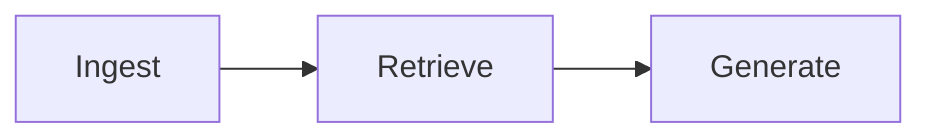

# Blog authoring conventions

Posts are markdown files in this directory (`www/docs/blog/<slug>.md`), served at
`/docs/blog/<slug>` by `blog#show`. Each post is also listed in the manual
`blog_info` manifest in `www/app/controllers/blog_controller.sl` (newest first).

## Every post MUST have a hero image

A post without an image looks unfinished on the index and at the top of the page.
When you add or update a post, always ship an illustration:

1. **Create the image** at `www/public/images/blog/<slug>.svg`. Prefer a
   hand-authored **SVG** (crisp at any size, tiny, diffable, no binary blobs, no
   external tooling). A raster `.jpg`/`.png` is acceptable only if a diagram
   genuinely can't express the idea.
2. **Embed it** near the top of the post (after the intro, before the first `##`)
   with the standard figure block:
   ```html
   <figure style="margin:1.5rem auto;max-width:1024px;">
     .svg" width="1024" height="576" alt="<describe the diagram>" style="display:block;width:100%;height:auto;border-radius:12px;border:1px solid #30363d;background:#0b0d0f;">
     <figcaption style="text-align:center;color:#8b949e;font-size:0.875rem;margin-top:0.5rem;"><one-line caption></figcaption>
   </figure>
   ```
3. **Register it** in the manifest entry: add `"image": "<slug>.svg"` alongside
   `"slug"`, `"file"`, `"desc"`, `"tag"`.

### Image style (match the site's solar theme)

- Canvas **1024×576** (16:9), dark background (`#0d0f12` → `#08090b` gradient).
- Amber/orange accents (`#f59e0b` / `#d97706`); reds (`#ef4444`) for
  error/tamper, greens (`#22c55e`) for success. Text in `#e5e7eb` / `#8b929e`.
- Cards: `#101319` fill, `#2b3038` border, `rx="14"`, monospace for code/hashes.
- Always set a descriptive `role="img"` + `aria-label` on the `<svg>` and a real
  `alt` on the ``. Keep code/values shown in the diagram accurate to the post.

See `tamper-evident-ledgers.svg` and `streaming-ai-progress.svg` for reference.

## Mermaid diagrams (optional)

Blog posts served through `layouts/docs` can include architecture flowcharts as
fenced Mermaid blocks — they render client-side via Mermaid.js (dark theme):

````markdown

````

Prefer a hero **SVG** for the main illustration; use Mermaid for supplementary
pipeline diagrams inside the body. Rendered diagrams get inline zoom controls
(+/−, reset), drag-to-pan, Ctrl+scroll zoom, double-click or expand for
fullscreen.
