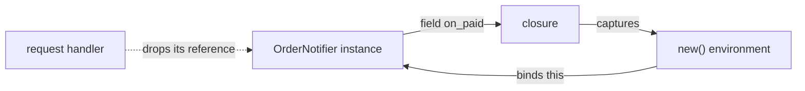

# Leaks a Closure Can Hide

A Soli worker is started once and then serves requests for days. Everything a
request allocates has to be gone by the time the next one arrives, or the worker
grows a little on every request until someone restarts it and calls it
"memory pressure". The interpreter frees memory by **reference counting**: every
value knows how many things point at it, and it is freed the instant that number
reaches zero. That is fast and predictable, and it has exactly one blind spot.

This line sits in that blind spot:

```soli
this.on_paid = fn(order) { @mailer.send_receipt(order) }
```

It runs. It works. The tests pass. And every instance that executes it stays in
memory until the process exits. Create 200,000 of them and peak memory is
**362 MiB**; store a method name instead of the closure and it is **34 MiB**,
flat, however many you create.

Soli now has a lint rule for this, `smell/closure-cycle`. Writing it sent us
through the runtime looking for the same shape, and the runtime had it too: in
the retry helper, in the form builder, and in every function that defines a
closure it never lets out. This post is about all of them, and about the leaks
in the same audit that were not cycles at all.

<figure style="margin:1.5rem auto;max-width:1024px;">
  
  <figcaption style="text-align:center;color:#8b949e;font-size:0.875rem;margin-top:0.5rem;">A closure on <code>this</code> points back at <code>this</code>. A method name does not.</figcaption>
</figure>

## What reference counting cannot see

When a request handler finishes, it drops its reference to the objects it built.
If nothing else points at an object, its count goes to zero and it is freed; that
frees whatever it held, and so on down.

A cycle breaks that. If A holds B and B holds A, then when the handler lets go,
each still has a count of one, from the other. Nothing outside can reach either
of them any more, but reference counting only looks at counts, and the counts
say both are still in use. A tracing garbage collector would notice that nothing
reachable leads to them. Soli's interpreter has no cycle collector, so they stay.



A cycle made only of plain data is hard to build by accident: you would have to
put an object inside its own field. A closure builds one for you, and you never
see it.

## A closure takes the whole room

A closure does not copy the names it uses. It keeps a reference to the entire
**environment** it was created in, so it can read and write those variables later.
Inside a method, that environment binds `this`.

Store the closure on `this` and the loop is closed: the instance holds the
closure, the closure holds the method's environment, the environment holds the
instance. The rule's source puts the non-obvious part plainly: *"It does not
matter whether the body mentions `this`: the captured environment holds it
either way."* This leaks just as much as the first example:

```soli
@formatter = |amount| { "#{amount} EUR" }
```

The convenience of a closure is that its inputs are implicit. So is what it holds
on to.

## Measuring one

To see the size of it, a class with a small payload and one closure stored on the
instance, constructed in a loop and immediately discarded:

```soli
class Notifier
  payload: Array
  on_paid: Any

  new()
    @payload = [1, 2, 3, 4, 5, 6, 7, 8, 9, 10]
    @on_paid = fn(order) { order }
  end
end

for i in 0..200000
  notifier = new Notifier()
end
print("done")
```

The comparison is the same file with `@on_paid = "handle_paid"`, a string where
the closure was. Peak resident memory (`ru_maxrss` of the child process), run as
a script with the current build:

| instances | closure on `this` | method name |
|---:|---:|---:|
| 50,000 | 111 MiB | 34 MiB |
| 100,000 | 195 MiB | 34 MiB |
| 200,000 | 362 MiB | 34 MiB |
| 400,000 | 698 MiB | 34 MiB |

A straight line, at about 1.7 KB per instance, against a flat one. Every
iteration's `notifier` goes out of scope; none of them is ever freed. In a
server, "every iteration" is "every request that builds one of these".

## The rule

`soli lint` flags an assignment whose target is rooted at `this` and whose value
is a closure literal:

```soli
class OrderNotifier
  mailer: Any
  handlers: Hash
  on_paid: Any
  formatter: Any

  new(mailer)
    @mailer = mailer
    @handlers = {}
    this.on_paid = fn(order) { @mailer.send_receipt(order) }
    @formatter = |amount| { "#{amount} EUR" }
    @handlers["refund"] = fn(order) { print(order) }
  end
end
```

```text
order_notifier.sl:10:5 - [smell/closure-cycle] a closure stored on `this` captures the method's environment, which holds `this`: the instance and the closure keep each other alive and are never freed; store a method name or pass the closure per call
order_notifier.sl:11:5 - [smell/closure-cycle] a closure stored on `this` captures the method's environment, which holds `this`: the instance and the closure keep each other alive and are never freed; store a method name or pass the closure per call
order_notifier.sl:12:5 - [smell/closure-cycle] a closure stored on `this` captures the method's environment, which holds `this`: the instance and the closure keep each other alive and are never freed; store a method name or pass the closure per call

3 issue(s) found in 1 file(s)
```

"Rooted at `this`" is walked through any depth of member, safe-member and index
access, so `this.x`, `@x` and `this.handlers["k"]` all count, and parentheses
around the closure do not hide it. The compound operators are covered as well:
`@rounder ||= fn(amount) { … }` is flagged the same way. The exit code is `1`,
so the rule works as a CI gate like every other rule.

## Two fixes

**Store a name, not a function.** A method name is a string; it holds nothing.
Dispatch on it with `send` when the event arrives:

```soli
class OrderNotifier
  mailer: Any
  handlers: Hash

  new(mailer)
    @mailer = mailer
    @handlers = {"paid": "send_receipt", "refund": "log_refund"}
  end

  def handle(event, order)
    method_name = @handlers[event]
    this.send(method_name, order) if method_name.present?
  end

  def send_receipt(order)
    print("receipt for #{order["id"]}")
  end

  def log_refund(order)
    print("refund for #{order["id"]}")
  end
end

notifier = new OrderNotifier("smtp")
notifier.handle("paid", {"id": 42})      # receipt for 42
notifier.handle("refund", {"id": 43})    # refund for 43
notifier.handle("unknown", {"id": 44})   # nothing
```

This is usually the better design anyway: the table of handlers is data you can
print, and each handler is a method with a name you can find.

**Pass the closure per call.** When the behaviour really does belong to the
caller, take it as an argument and use it before returning. The closure lives for
one call and is never stored:

```soli
class Report
  def rows(orders, format_amount)
    orders.map(fn(order) format_amount(order["total"]))
  end
end

report = new Report()
print(report.rows([{"total": 10}, {"total": 25}], |amount| { "#{amount} EUR" }))
# [10 EUR, 25 EUR]
```

A closure that is only ever *local* to a method is not the problem either: that
is the runtime's job, and it now does it (see below).

One legitimate exception: an object built once at boot and kept for the life of
the worker leaks exactly one instance, which is the same as not leaking. Say so
where it happens, so the next reader knows it was a decision:

```soli
# soli-lint-disable-next-line smell/closure-cycle
this.on_paid = fn(order) { @mailer.send_receipt(order) }
```

A related fix shipped alongside: `@items ||= []` now initialises a field nothing
has set yet. `||=`, `&&=` and `??=` read the property first, and reading one that
did not exist raised `NoSuchProperty`, so a lazily initialised instance variable
could never be initialised. The read now answers `null` in both engines;
`@n += 1` on an unset field still raises. Caching *data* lazily on an instance
is fine. Caching a closure there is the thing to avoid.

## What the rule cannot see

The rule is syntactic: it matches a closure literal written straight into
`this`. Two variations that leak just as much pass it cleanly, and both are worth
knowing by shape.

Through a local, or inside a collection:

```soli
def prepare
  handler = fn(order) { order }
  @callbacks = [handler]       # not flagged; the same cycle
end
```

And a cycle that never touches the receiver's `this`:

```soli
def checkout(order_id)
  notifier = new Notifier()
  notifier.subscribe(fn(order) { order })   # stored in notifier's @callbacks
  order_id
end
```

The second one is worth reading slowly. The closure is created in `checkout`, so
it captures `checkout`'s environment, which binds `notifier`. `subscribe` stores
it in `notifier`. Now `notifier` holds the closure, the closure holds the
environment, and the environment holds `notifier`. Both of these, run 200,000
times, peak at about 384 MiB. Rewriting `subscribe` as a `deliver(order,
callback)` that calls the callback and returns brings the second back to 34 MiB.

The question to ask of any closure you store is: **can the thing I am storing it
in reach back to the scope that created it?** If yes, you have a cycle.

## The runtime had the same bug

Soli's standard library is partly written in Soli. `Retry` is a Soli class in
`retry.sl`, compiled into the binary and evaluated at startup, and
`register_retry_class` evaluated it *into the environment it was registering
into*. `Retry`'s methods closed over that environment; the environment owned
`Retry`. A cycle.

For a single global interpreter that would cost nothing. But the runtime builds a
throwaway `Interpreter` for every call of a named scope, every user method on a
primitive, every validator, and each one registered `Retry`. Each one therefore
kept its entire builtins registry, about 350 KB, alive after it was dropped. A
page making a few dozen scope calls grew its worker by megabytes on every request.

The fix is the one the lint rule recommends, at Rust scale: the class is now
evaluated once per thread into an environment of its own, and defined into each
interpreter by reference. The class points at its own home and at nothing it is
registered into, so those can go. Two tests pin it, and they are the pattern to
copy for any "does this get freed" question: take a weak reference, drop the
owner, check that the weak reference is dead.

```rust
#[test]
fn dropping_an_interpreter_frees_its_globals() {
    let interp = Interpreter::new();
    let globals = Rc::downgrade(&interp.environment);
    drop(interp);
    assert!(
        globals.upgrade().is_none(),
        "the builtins registry outlived its interpreter"
    );
}
```

The form builder (`form_with` and friends, also Soli source) had the identical
shape, and there it leaked a whole builtins registry on **every hot reload**. It
got the identical fix.

### The cycle every nested function makes

The more general version lived in the function call itself. A `def` or `fn`
evaluated inside a function captures that function's environment and is bound
back into it: `env → binding → function → closure → env`. So every call that
defined a local helper leaked its locals, query results included.

Without a cycle collector, the runtime now does **trial deletion** for this one
shape, at the moment a call or block scope is abandoned. It counts every strong
reference to the environment. A function bound in the scope whose reference count
equals the number of bindings holding it is *internal*: no array, hash, field,
global, return value or thrown value has it, because each of those would add one
more. If the internal functions' captures plus the caller's own reference account
for every reference to the environment, nothing outside can reach it, and its
bindings are dropped, which breaks the cycle. Anything unaccounted for, a closure
that escaped by any route, leaves the scope untouched. Over-counting is the only
way it could be wrong, and every counted reference is a distinct pointer checked
by identity.

That is why the lint rule exists at all. A closure stored in a field has
*escaped*: it is one reference the proof cannot account for, so the runtime
correctly leaves it alone, and the cycle through `this` has to be prevented in
the source.

One gap turned up while measuring for this post. The trial deletion runs at the
end of a function call and of a block, but not at the end of a constructor body.
A closure that is merely local to `new()`, never stored anywhere, still leaked
in our measurement: 200,000 instances peaked at 365 MiB, where the same local
closure in an ordinary method stayed at 33 MiB. Until that is covered, keep
helper closures out of constructors.

A smaller relative: each function keeps its last call environment parked for
reuse, and that environment still held the last call's locals (a request's
records, `this`) until the next call. For a function called once per boot, that
meant for the life of the worker. It is emptied before it is parked now.

## Leaks that were not cycles

The same audit found three more ways a long-lived worker grew, and none of them
involved a cycle. Each was a structure with an *add* on the path that runs and a
*remove* on a path that did not.

**Per-request logs on a socket.** Queries, HTTP calls, spans and the rest are
thread-local buffers a worker fills as it serves and the dev bar reads at the end.
They were emptied at the front door of an HTTP request, and a LiveView or EUI
event never came through that door. In `--dev` the flamegraph records a span per
function call, so a view redrawing ten times a second grew the log by close to a
megabyte a second. Measured on a real EUI app: 0.85 MB/s with `--dev` and
0.16 MB/s without, before; 66 to 72 MB over a minute and then flat, after. The
reset is one function now, `forget_request_logs`, called from both doors, and the
query, HTTP and KV logs keep at most 10,000 entries per request, event or job.

**In-memory sessions.** The default session store grew for the life of the
process. It is now swept every 1,000 creations or 30 seconds and capped by
`SOLI_SESSION_MAX_IN_MEMORY` (default `100000`, `0` for unlimited); past the cap,
the least recently used sessions are evicted, which logs those users out.

**SSE subscribers.** A disconnected subscriber was removed only when something was
broadcast to its topic, so a quiet topic kept every client that had ever
subscribed to it, with its channel buffer. Registering now prunes the topic it
joins, and every 256th registration sweeps all topics and removes the empty ones.

In the same family: query bind-variable names used to be interned into the
process-wide symbol table, so a `where` key chosen by the client cost memory for
the life of the worker. They are plain strings now.

## Finding one in your app

1. **Run `soli lint`.** It catches the direct form, which is the common one.
2. **Watch a worker under repetition.** Send the same request a few thousand
   times and read the process's RSS (`ps -o rss= -p <pid>`) along the way. A
   healthy worker climbs during warm-up and then goes flat. A leak keeps a slope,
   and the slope divided by the request count tells you how much each request
   leaves behind.
3. **Bisect by action.** Once one endpoint has the slope, look in its call path
   for a closure stored anywhere that outlives the call: a field, a hash of
   handlers, a subscriber list, a registry. Then ask the question from above: can
   what it is stored in reach back to where it was created?
4. **Replace it** with a method name, or pass it per call.

Reference counting gives Soli predictable, immediate cleanup with no collector
pauses, and the price is that a cycle is yours to avoid. Most of the time you
will never make one. The rule is there for the time you do, and the runtime has
now stopped making them for you.

Full reference: [Linting](/docs/development-tools/linting).
