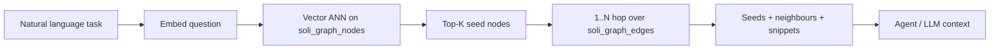

# Code Graph RAG: Give Agents a Map of Your App

Flat search — keyword or pure vector — answers “which files *sound* like authentication?” Graph RAG answers a harder question: **which code is involved, and what does it connect to?**

When an agent works on a Soli app, it needs more than a bag of snippets. It needs to know that `POST /login` routes to `SessionsController#create`, that the action calls `User#authenticate`, that it renders `sessions/new`, and that a failed path redirects to another route. Those relationships are already in the source. Until now, most agent setups rediscovered them by grepping and guessing.

**`soli graph build`** turns your project into a first-class **code graph** in SolidB — the same database your Models already use — with optional embeddings on every node. **`soli graph query`** is the one-shot retrieval path: semantic seed, then hop along real edges. That is graph RAG over *your* codebase, not a third-party indexer bolted on the side.

<figure style="margin:1.5rem auto;max-width:1024px;">
  
  <figcaption style="text-align:center;color:#8b949e;font-size:0.875rem;margin-top:0.5rem;">Build structure + embeddings once; query by meaning; expand along edges so agents see the full local neighborhood — not an isolated hit.</figcaption>
</figure>

## What it adds to the Soli stack

Soli already had the pieces for *data* RAG: `embed()`, `.similar()`, hybrid search, `llm_generate` — all against SolidB. The code graph reuses that machinery for *source*:

| Layer | Already in Soli | Code graph |
|-------|-----------------|------------|
| Storage | SolidB collections + edges | `soli_graph_nodes` / `soli_graph_edges` (namespaced, never clash with app data) |
| Vectors | `vector_index`, ANN | Every node’s `text` embedded (or `--no-embed` for offline structure only) |
| Retrieval | `Model.similar`, hybrid | `soli graph query` (seed → expand) or AQL / `CodeNode.similar` |
| Ops | Same `.env` as Models | Incremental MD5 sync, dev auto-reindex on save |
| Agents | `CLAUDE.md`, verification loop | Structured JSON neighbourhoods for tool-using agents |

No separate vector DB. No LangChain graph package. No second deployment story. If the app can talk to SolidB, the code graph lives next to it.

That matters for the “AI coding agent” story Soli already pushes: projects ship with conventions and a verification loop. The graph is the **map** those agents were missing — precise, queryable, and kept current while you develop.

## Build: from tree to graph

```bash
soli graph build            # app in .
soli graph build path/to/app
```

By default the build:

1. **Parses** the project (routes, controllers, models, views, methods, …).
2. **Extracts** nodes and precision-first edges (`defines`, `inherits`, `calls`, `renders`, `routes_to`, `redirects`, `relates`, …).
3. **Embeds** each node’s retrieval text (kind, name, signature, doc, snippet).
4. **Syncs** into SolidB **in place** — insert / update / prune — so concurrent readers never see an empty graph and unchanged embeddings are reused.

Configure embeddings with the usual knobs (`SOLI_EMBEDDING_API_KEY`, URL, model). SolidB comes from the project `.env` (`SOLIDB_*`), same as `soli db:seed`.

Useful flags:

```bash
soli graph build --dry-run | jq '.nodes | length, .edges | length'   # no DB, no API
soli graph build --no-embed                                         # structure only, offline
soli graph build --fresh                                            # full rebuild (e.g. new model)
```

Re-runs are cheap when nothing changed (`✓ code graph already up to date`). Large projects get a progress bar over parse → embed → sync.

### Edges that match how Soli apps are wired

A typical login action produces a small, honest neighbourhood:

```soli
# app/controllers/sessions_controller.sl
def create(req: Any) -> Any {
    let user = User.find_by("email", req["email"])  # binds user → User
    user.authenticate(req["password"])              # calls → User#authenticate
    return redirect("/dashboard")                   # redirects → matching route
}
```

Call resolution is **precision-first**: class methods, `this.`, locally typed receivers (`let u = User.find(...)` then `u.authenticate`), bare `super` when the parent method exists. Unbound receivers stay unlinked rather than inventing edges. That keeps the graph trustworthy for agents — fewer edges, higher confidence.

## Query: the agent-facing API

```bash
soli graph query "where is authentication handled?"
soli graph query "refund flow" --json --limit 5 --hops 1
soli graph query "invoice validation" --path api/
soli graph query "login" --kind method,controller
```

Pipeline:



`--json` returns seeds with scores, file/line/signature, a short snippet, and ordered neighbours (structural kinds first: `routes_to`, `calls`, `renders`, `redirects`, …). No embedding vectors in the payload. If the graph was built with `--no-embed`, query falls back to a weighted keyword scan so the command still works offline.

Agents can also open SolidB directly — find by kind/name, `similar` on a thin `CodeNode` model, then `FOR v, e IN 1..2 OUTBOUND …` traversals. The CLI is the happy path; the database is the power path.

## Dev: stay current without thinking about it

With an embedding key set:

```bash
soli serve . --dev
```

Saving a `.sl` / `.slv` reindexes on a background thread (debounced file watcher). Only changed node text is re-embedded. Turn off with `SOLI_GRAPH_WATCH=0`, or force structural reindex without a key with `SOLI_GRAPH_WATCH=1`.

That closes the loop for agentic workflows: the human edits, the map updates, the next `soli graph query` sees reality — not last week’s index.

## Not only Soli apps

Point the same tool at any repo:

```bash
soli graph build /path/to/rails-app --ext rb,erb,slim
# or commit .soligraph.toml and run soli graph build
```

Tree-sitter extractors cover Ruby, Python, JS/TS, Rust, and C# (structure +, for C#, a precision-first call/`new` graph). Other extensions are chunk-embedded so semantic search still covers templates and config. Storage, incremental sync, and `soli graph query` stay the same.

So the Soli CLI becomes a **polyglot code-graph indexer** that still lands in SolidB — useful for mono-repos and for teams adopting Soli next to existing services.

## How this differs from product RAG

| | **Product / domain RAG** | **Code graph RAG** |
|--|--------------------------|--------------------|
| Subject | Catalog, docs, tickets | Controllers, models, routes, views |
| API | `Model.rag`, `.similar()`, hybrid | `soli graph build` / `query` |
| Structure | Optional graph over *data* | First-class edges over *source* |
| Audience | End users, support bots | Coding agents, internal tools |

Both sit on SolidB and embeddings. One grounds answers in what you *sell or store*; the other grounds agent edits in how the *application is wired*.

## A practical agent loop

1. **Task** — “Add rate limiting to login.”
2. **Map** — `soli graph query "login authentication rate limit" --json --kind method,controller,route`.
3. **Edit** — agent changes only the neighbourhood it retrieved (controller, middleware, route).
4. **Verify** — `soli lint` / `soli test` (the project’s existing agent contract).
5. **Refresh** — dev watch already reindexed; next query includes the new edges.

You do not replace judgment or tests. You stop the agent from starting every task with a blind full-repo scramble.

## Try it

```bash
# from a Soli app with SolidB configured
export SOLI_EMBEDDING_API_KEY=sk-...   # optional but enables semantic query
soli graph build
soli graph query "where do sessions get created?" --json
```

Full reference: [Code Graph](/docs/development-tools/graph) in the docs. For domain RAG on product data, see [RAG Product Discovery](/docs/blog/rag-product-discovery).

**Bottom line:** Soli’s stack already unified app data, vectors, and jobs in one runtime. The code graph extends that unity to *source structure* — so agents get a living map of the MVC graph, not just a search box over text.
