# Ship a Desktop App With `soli desktop build`

You built a Soli app for the web: models, controllers, LiveView, SolidB, the
whole stack. Then someone asks for a **local** product — an offline-friendly
tool, an internal console that should not hit your servers, a vertical app that
ships as a file the user double-clicks.

The usual answers are heavy: wrap Electron around a separate backend, run a
Postgres installer, invent an update story, and spend a quarter on packaging
before the product exists. Soli takes the other route.

```bash
soli desktop build ./myapp --app-id com.example.myapp
```

That produces **one executable**. The user runs it; a private database starts on
loopback; their browser opens; the app is live. No installer, no separate
database process, no config file they have to get right.

<figure style="margin:1.5rem auto;max-width:1024px;">
  
  <figcaption style="text-align:center;color:#8b949e;font-size:0.875rem;margin-top:0.5rem;">One file in, one double-click out. Runtime, encrypted app, database, and seeds travel together.</figcaption>
</figure>

## What problem this solves

A Soli web app already *is* a full product: HTTP server, ORM, templates, jobs,
auth. The missing piece for desktop distribution was packaging that stack so a
non-developer machine can run it without ops.

`soli desktop build` is that packaging step. It is not a new UI toolkit and not
a second language. It is the same app you already write, frozen into a
self-contained process that owns its data directory and opens the UI in the
user's browser (or in a native shell you provide — more on that below).

If your mental model is "Rails/Laravel as a local product," you are close. The
difference is that the database travels *inside* the artifact, starts on an
ephemeral port, and dies cleanly with the process.

## What is inside the file

```
[ soli runtime ]
[ manifest        — app identity, versions, checksums ]
[ app.sole        — your application, always encrypted ]
[ solidb          — the database binary, compressed ]
[ ref_*.ndjson    — optional read-only reference data ]
```

A typical artifact is **70–80 MB**, most of it the compressed database binary.
That is the whole product: runtime, code, storage engine, and seed data.

Two constraints are non-negotiable:

1. **The application is always encrypted.** There is no "unencrypted desktop
   build." Shipping source in the clear to every install would make the format
   a distribution of your codebase, not a product.
2. **Unlock requires a key at launch** — either `SOLI_BUNDLE_KEY` or a key
   server via `SOLI_BUNDLE_AUTH_URL`. The key is **never written to disk**. That
   is what makes revocation possible: cut the key, and installs stop starting.

There is no offline fallback. If the key cannot be resolved, the app does not
run. That is the explicit trade for being able to revoke a leaked or unpaid
install.

## What happens on double-click

```mermaid
flowchart LR
  Start[Launch] --> Lock[Single-instance lock]
  Lock --> Key[Fetch unlock key]
  Key --> DB[Start private SolidB on loopback]
  DB --> Seed[Import changed ref_* data]
  Seed --> Gate[Single-use launch token]
  Gate --> Browser[Open browser / shell URL]
  Browser --> Run[Serve app]
  Run --> Stop[SIGTERM]
  Stop --> Wipe[Remove decrypted tree]
  Wipe --> Close[Close database cleanly]
```



Concretely:

1. **Single-instance lock** — a second launch is refused while the first holds
   the data directory. Two servers over one store would fail deep inside the
   engine with an unhelpful error; the lock fails early instead.
2. **Key fetch** — no key, no app.
3. **Private database** — SolidB on an OS-assigned `127.0.0.1` port, with
   per-install credentials. Nothing listens on the LAN.
4. **Reference data** — seed collections re-import only when their content
   changed.
5. **Port gate** — loopback keeps the network out, but not other local
   processes. The browser is launched with a **single-use token** it exchanges
   once for a session cookie; everything else gets `403`. The token expires in
   60 seconds; a wrong guess burns it.
6. **Clean stop** — `SIGTERM` (or closing the terminal) removes the decrypted
   application tree first, then closes the database. A hard `kill -9` skips
   that; leftovers are swept on the next launch. Prefer the clean path —
   abrupt kills make the storage engine replay its WAL and feel like
   corruption.

## Where user data lives

| | Data (persists) | Cache (safe to delete) |
|---|---|---|
| Linux | `$XDG_DATA_HOME/<app-id>/db` | `$XDG_CACHE_HOME/<app-id>/bin` |
| macOS | `~/Library/Application Support/<app-id>/db` | `~/Library/Caches/<app-id>/bin` |
| Windows | `%LOCALAPPDATA%\<app-id>\db` | `%LOCALAPPDATA%\<app-id>\cache\bin` |

`--app-id` is reverse-DNS (`com.example.myapp`) and **required**. It is also
load-bearing: change it between releases and you orphan every existing install's
data directory. Treat it like a product identity, not a display string.

The database binary is cached and re-verified against its checksum each launch.
Deleting the cache costs one extraction, not the user's data.

## Sensitive fields at rest

The database files sit in the user's own directory. Mark what must stay
confidential:

```soli
class Customer < Model
  encrypts :tax_id, :bank_account
end
```

Encrypted fields use a fresh nonce per write, so they **cannot be queried by
value**. Encrypt secrets; do not encrypt the columns you filter on. Fields you
leave unmarked are plaintext — `strings` on the data directory will find them.

## Reference data without stomping user tables

Read-only tables — countries, currencies, SKU catalogs — can ship with the
artifact:

```bash
soli desktop build ./myapp --app-id com.example.myapp --seed ./seed
```

Each `seed/<name>.ndjson` is one JSON document per line. Import happens at first
launch and again only when the content changes.

**Seed collections must be named `ref_*`.** The build fails otherwise, and the
reason is intentional: import **replaces a collection wholesale**. Without the
prefix, shipping `users.ndjson` would wipe the user's own `users` data on the
next launch. The prefix keeps product reference data and user data in disjoint
namespaces by construction.

```
seed/
  ref_countries.ndjson     ✓
  ref_currencies.ndjson    ✓
  users.ndjson             ✗ build fails
```

## Cross-build from one machine

`--target` downloads a published runtime and database for that platform and
checksum-verifies both. It does not compile from source, so one CI host can
produce every platform:

```bash
soli desktop build ./myapp --app-id com.example.myapp --target linux-amd64
soli desktop build ./myapp --app-id com.example.myapp --target darwin-arm64
soli desktop build ./myapp --app-id com.example.myapp --target windows-amd64
```

Supported targets today: `linux-amd64`, `linux-arm64`, `darwin-amd64`,
`darwin-arm64`, `windows-amd64`.

Distribution notes that bite after the build:

- **macOS** — an artifact built on Linux has an invalid signature; Apple Silicon
  will refuse it until you re-sign (`codesign --force -s -` on a Mac, or
  `rcodesign` from anywhere).
- **Windows** — unsigned binaries hit SmartScreen ("Windows protected your
  PC"). Sign the **finished** `.exe` with `signtool` after packaging — signing
  before packaging invalidates the signature.

## Staying current without emailing "please re-download"

A desktop artifact is frozen by default. Pair it with a release channel and it
can check for a newer signed build and replace itself:

```bash
soli desktop build ./myapp --app-id com.example.myapp \
  --update-url https://updates.example.com/myapp \
  --update-key <p256-pubkey>
```

The running app then understands `--check-update` / `--update`, or the same
flow from Soli via `Updater.check()` / `Updater.apply()`. Manifests are
P-256-signed; downgrades are refused; unsigned production channels are a bad
idea on purpose.

That is a separate ops surface — keys, canaries, fix-forward rollbacks. See
[How to Operate a Release Channel](/docs/blog/release-channels) and the
[auto-update docs](/docs/development-tools/auto-update).

## Embed in your own shell

By default the artifact opens a chrome-less browser window. If you wrap it in
Cocoa/WebView, an Electron-style container, or any shell that already owns the
window:

```bash
SOLI_DESKTOP_NO_WINDOW=1 ./myapp
```

The server opens nothing. It still prints the launch URL (with the single-use
token) on its own indented line — your shell must load *that* URL; pointing at
`http://127.0.0.1:<port>/` alone gets `403`.

Send `SIGTERM` when the window closes so the decrypted tree and database shut
down in order. For OS notifications inside a web view (no Push API, no
Notifications API), use the [Native Bridge](/docs/development-tools/native-bridge)
— `Native.notify` raises a real notification in the shell without VAPID or a
push service.

## What this protects against — and what it does not

"Encrypted desktop app" promises more than any local software can deliver. Be
precise with your users and yourself.

**It does protect against:**

- A copied artifact being useful without an authorized key
- Casual inspection of application source
- Other local processes casually driving the API or database without the launch
  token
- **Revoking** an install by cutting the key

**It does not protect against the machine's owner.** The key reaches the process
environment at launch. On their own machine a motivated user can read it — from
`/proc/<pid>/environ`, a debugger, or process memory. Once they have it, that
data decrypts offline forever.

Treat desktop encryption as **licensing-grade protection**: stop casual copying,
enable revocation. It is not confidentiality against your user. Data whose
disclosure *to that user* would be a breach belongs on your server behind an
authenticated API; cache only derived, non-sensitive results locally.

One more loopback caveat: cookies are not port-scoped, so another local server
in the same browser profile could read the session cookie. Closing that fully
needs loopback HTTPS and the user's trust store — a deliberate non-goal for v1.
What the gate *does* close is a non-browser local process driving your API.

## A minimal product checklist

1. **Stable `--app-id`** before the first customer install.
2. **Key delivery** wired (`SOLI_BUNDLE_KEY` or auth URL) in both build and
   run environments.
3. **Seeds** only under `ref_*` if you ship catalogs.
4. **`encrypts`** on fields that must not be `strings`-able on disk.
5. **Cross-build matrix** + platform signing (codesign / signtool) in CI.
6. **`--update-url` / `--update-key`** if you expect more than one release.
7. Honest docs for operators: what revocation does, what it does not.

## The short version

`soli desktop build` turns the Soli app you already have into a single
double-clickable binary with its own database, encrypted source, optional
reference data, and a real path to signed OTA updates. Same language, same
models, same templates — different distribution shape.

It is not Electron with a thinner config file. It is the Soli stack, frozen,
with the security model written down up front: licensing and revocation, not
"the user cannot read their own machine."

Build it, sign it for the platform, ship the file. When you need the next
version, operate a channel — do not ask everyone to re-download by hand.

Full reference: [Desktop Applications](/docs/development-tools/desktop).
