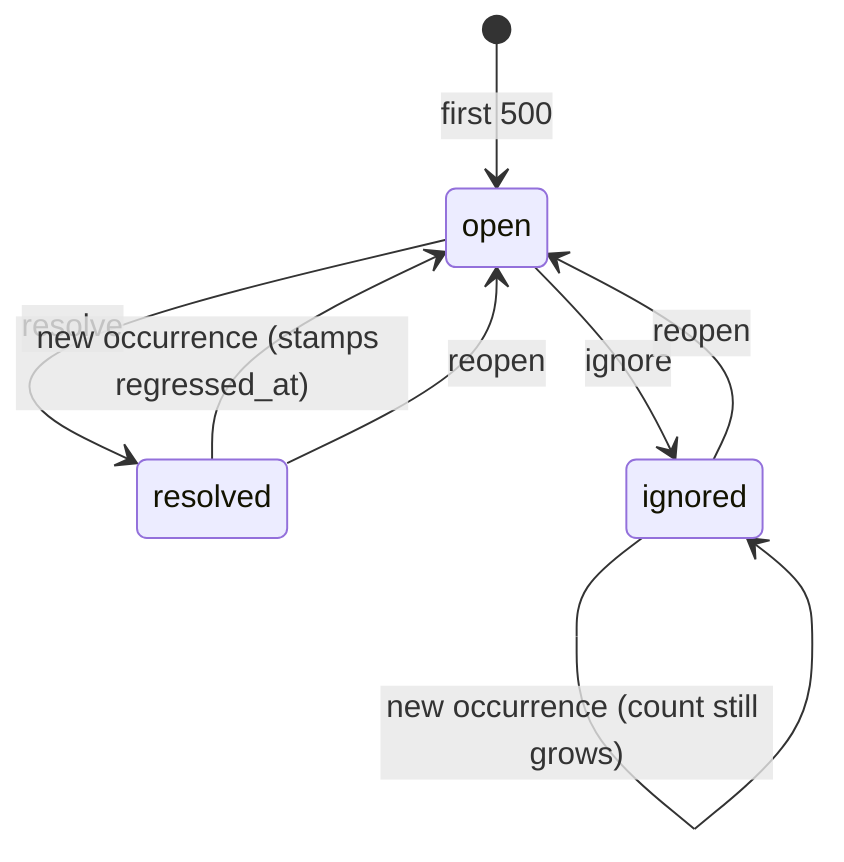
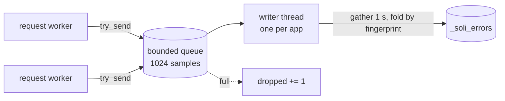

# Your 500s, Grouped: Error Tracking With No Sentry

Before this release, a Soli app that failed in production did one thing: it wrote
a block to stderr. A good block — the request id, the method and path, the stack,
a redacted request snapshot and the handler's local variables — but a block in a
log stream. When the same bug fires four hundred times overnight you get four
hundred blocks, interleaved with everything else, and the question you actually
have in the morning ("what broke, how often, and is it still breaking?") is a
`grep` and a `sort | uniq -c` away.

The usual answer is an error tracker: Sentry, or one of its cousins. That means
an account, an SDK, a DSN in your config, and every failing request — headers,
params, locals — shipped to a third party's servers. For a lot of apps that is a
fine trade. For a lot of others it is one more service, one more bill and one more
data processor to list, for something the server already had in its hands.

Soli 2.5.2 keeps it in the app. Every request that ends in a 500 is grouped by
cause and stored in the app's own database, in a `_soli_errors` table, and shown at
`/__soli/errors`. There is nothing to install and nothing to configure: it is on by
default.

<figure style="margin:1.5rem auto;max-width:1024px;">
  
  <figcaption style="text-align:center;color:#8b949e;font-size:0.875rem;margin-top:0.5rem;">Three requests, one bug, one row — written off the request path, into the database the app already has.</figcaption>
</figure>

## What it looks like

Here is a controller with a bug in it. `total_for` assumes every order has line
items:

```soli
# app/controllers/orders_controller.sl
def total_for(order_id)
  line_items = {"7": [10, 20]}
  line_items[order_id].sum()
end

def show(req)
  order_id = req["params"]["id"]
  total = total_for(order_id)
  render_text("total: #{total}")
end
```

I ran it under `soli serve . --dev` against a SQLite file and hit it three
times. `/orders/7` answered `total: 30`; `/orders/42` and `/orders/97` answered
500. Two seconds later, `/__soli/errors` listed one open group, not two:

```text
Cannot access property 'sum' on null at 3:3
Raised in   total_for at app/controllers/orders_controller.sl:3
Occurrences 2
```

Open it and each occurrence carries its stack, the handler's locals, and a line
to replay it:

```text
stack
orders#show at app/controllers/orders_controller.sl:1
show at app/controllers/orders_controller.sl:6
total_for at app/controllers/orders_controller.sl:3

reproduce
curl -X 'GET' 'http://localhost:5011/orders/97' \
  -H 'accept: */*' \
  -H 'user-agent: curl/8.22.0'

locals
{
  "cookies": "[REDACTED]",
  "line_items": { "7": [10, 20] },
  "order_id": "97",
  ...
}
```

`order_id` is `"97"`, and `line_items` has no such key. That is the whole
diagnosis, without opening a log. The rest of this post is about the three things
that make it work: deciding which failures are the *same* failure, storing them
somewhere you already run, and doing both without costing the request anything.

## Grouping is the product

An error tracker lives or dies on its grouping. Group too finely and every
failing order id is its own "issue", and the list is as useless as the log. Group
too coarsely and two different bugs hide inside one count.

Soli's fingerprint is built from two things: the error message with its variable
parts removed, and the frame that raised it without its line number. The
normalization, in `src/serve/error_tracker.rs`, is deliberately blunt:

- anything in single or double quotes becomes `?`;
- any word containing a digit becomes `#` — ids, counts, UUIDs, timestamps, hex.

So `User 42 not found: "alice@x.io"` and `User 97 not found: "bob@y.io"` are one
group, and `no job 550e8400-e29b-41d4-a716-446655440000 (0xff)` becomes
`no job # (#)`. Both are unit tests in the module. The message above becomes
`Cannot access property ? on null at #:#` — which matters, because the
interpreter appends a `line:column` to the message itself, and without the second
rule every edit to the file would change it.

The location is the innermost frame of the stack, with its trailing `:line`
dropped: `total_for at app/controllers/orders_controller.sl`. Dropping the line
means adding a comment above the bug doesn't start a new group. Keeping the
*function and file* means the same message raised from two places stays two
groups — `boom` in `show` and `boom` in `index` are different bugs. Frame paths
are rewritten relative to the app root before any of this happens, so deploying
the same code to `/srv/app-v2` instead of `/srv/app` keeps its history.

The two parts are joined with a NUL byte, hashed with SHA-256, and the first
eight bytes become the group's key — sixteen hex characters, like
`ca84884f39150dba`. The dashboard refuses any key that isn't exactly that shape
before touching the database, so a path segment can never become a query.

The trade-off is the obvious one. A message whose meaningful difference is a word
with a digit in it — `v1 endpoint` versus `v2 endpoint` from the same function —
collapses into one group. That errs toward fewer rows, which is the cheaper
mistake: an over-merged group still shows you five distinct samples.

## One row per bug, in your database

A group is one document in `_soli_errors`:

```text
{ _key: <fingerprint>, message, location, status: open|resolved|ignored,
  count, first_seen, last_seen, resolved_at?, regressed_at?,
  last_request: "GET /orders/7",
  hourly: [ ["2026-09-24T18", 12], … the last 24 hours seen ],
  samples: [ newest first, at most 5 ] }
```

It is written through the same document facade the job queue uses, so it works
on every backend Soli talks to — SoliDB, Postgres, MySQL and SQLite. On SQLite
the tracker creates the table and an index on `status` the first time it writes;
in my test run `sqlite_master` showed `_soli_errors` and `idx__soli_errors_status`
and nothing else of mine.

Keeping only the **five newest samples** is what makes storing this in an
application database reasonable. A bug that fires a million times is still one
row with a counter and five examples; the table's size tracks how many *distinct*
problems you have, not how much traffic hit them.

One small detail worth showing, because it is the kind of thing that bites: the
24-hour histogram is stored as an array of `[hour, count]` pairs, not as an object
keyed by hour. The update is a merge-patch, and a merge-patch deep-merges
objects — an hour trimmed from an object would silently survive in the stored
document forever. An array is replaced whole.

## Open, resolved, regressed, ignored

A group has three stored statuses, and a fourth state that is really a timestamp:



**Resolve** is the claim "I fixed this". If the fingerprint shows up again, the
writer flips the group back to `open` and stamps `regressed_at` with the first new
occurrence, and the list tags it **regressed**. I tried it: resolved the `sum`
group, requested `/orders/13`, and it came back at the top of the open list with
three occurrences and the tag. **Ignore** is for the noise you have decided to
live with — the group keeps counting but leaves the list. **Delete** forgets it
entirely.

## What a sample carries — and what it leaves out

A sample is the snapshot the stderr error block already printed: the stack (the
innermost 50 frames), the request, and the environment at the failure — locals of
the raising frame plus `req`, `params` and `cookies`. It holds nothing the log did
not.

Redaction happens before the sample is queued, with the same rules as the log.
Authorization headers and cookies are replaced by `[REDACTED]`; so is any param or
local whose name contains `password`, `token`, `secret`, `api_key`, `auth`,
`csrf`, `cookie`, `credential` and a few others (`src/redaction.rs` holds the
list, matched case-insensitively as substrings). A POST of
`name=bob&password=hunter2` was stored as:

```text
"form": { "name": "bob", "password": "[REDACTED]" },
"body": "[REDACTED]",
```

That `body` line is a fix this feature forced. The error log redacted `req.form`
and `req.json` field by field, but printed `req.body` — the raw
`password=…&…` string, which has no field name to match — in full, to stderr and
into whatever log shipper sat behind it. Storing samples in a table made the gap
visible; now any hash shaped like a request has its raw body redacted.

Redaction goes by name, and names are all it has. A field called `card` is not
recognised as a secret. The docs say it plainly: don't put card numbers in forms
you do not control.

The `curl` line is built from the redacted request, so it leaves out every
redacted header (a `[REDACTED]` bearer token would only fail differently) along
with the ones curl sets itself (`host`, `content-length`, `connection`,
`accept-encoding`). It targets `http://localhost:5011`, the default `--dev` port,
because the point is to replay a production failure against your own machine. It
does not carry a body: for my POST it reproduced the method, path and
`content-type`, and I had to supply the form fields myself.

## Never on the request path

Recording has one hard rule: it must not make a failing request slower, and it
must never make it fail differently. So the request worker does almost nothing.
`error_logging::log_production_error` — the one place every 500 already passes
through — calls `error_tracker::record`, which builds the sample and calls
`try_send` on a bounded channel. `try_send` does not block. If the channel is
full, the sample is dropped and an atomic counter goes up.



On the other side is one writer thread per application, started lazily by that
app's first failure. It blocks until a sample arrives, then keeps gathering for
one second, folding repeats of the same fingerprint into a single pending update:
count, histogram, newest samples. When the second is up it writes one read and one
write per *group*, not per occurrence. A burst of a thousand identical 500s
inside that window costs two database round-trips.

If errors arrive faster than the writer can drain them, the page says so rather
than pretending the counts are complete:

```text
N occurrence(s) dropped since this process started: errors arrived faster than they could be written.
```

Dropping is the right failure here. An error tracker that applies back-pressure to
the requests it is observing turns a bug into an outage.

One consequence of the design, stated in the module's own header: counts are
exact within one process, because one writer owns them. Several processes or
hosts writing the same group each read-modify-write it independently, so a
concurrent burst across machines can undercount. The group itself is never lost.

## Who gets to see it

Error samples are a dense concentration of sensitive context, so the page sits
behind the gate the jobs page already had, now shared in
`src/serve/admin_auth.rs`:

- Under `--dev`, it is open to a request from the machine itself — a loopback
  peer on a local host name, which rules out DNS rebinding — and linked from the
  dev bar's tools panel as "grouped failures, triage". A LAN peer is not local,
  even in dev: `--dev` binds `0.0.0.0`.
- Everyone else needs credentials: HTTP Basic from `SOLI_ERRORS_USER` +
  `SOLI_ERRORS_PASSWORD`, or a bearer token from `SOLI_ERRORS_TOKEN`. The new
  `SOLI_ADMIN_USER` / `SOLI_ADMIN_PASSWORD` / `SOLI_ADMIN_TOKEN` are accepted by
  both `/__soli/errors` and `/__soli/jobs`, so one set covers every operator page.
  Every configured pair is compared in constant time, whichever one matches.
- With no credentials configured, the path answers **404**. Production doesn't
  advertise that the page exists.

The triage buttons are plain same-origin form posts, which raises the classic
problem with Basic auth: the browser attaches the credentials to a cross-site
request too. The page keeps the CSRF barriers the jobs page has. From curl, a
`resolve` with a matching `Origin` got a `303`; an `ignore` with
`Origin: https://evil.example` got a `403`.

## Turning it off

```bash
SOLI_ERRORS=off    # stop recording; the page still lists what is stored
```

`off`, `0`, `false` and `no` all work. Under `APP_ENV=test` recording is off
unless `SOLI_ERRORS=on`, so a spec run that exercises your 500 paths doesn't fill
the table with failures you caused on purpose. When recording is off, the page
says so at the top instead of looking suspiciously quiet.

## What it is not

This is a stand-in for Sentry for one app's HTTP failures, and it is worth being
exact about the edges:

- **No alerts.** Nothing emails you or posts to a channel. You find out when you
  look. If you need paging, you still need something that pages.
- **HTTP 500s only.** Job failures stay on `/__soli/jobs`. LiveView and EUI event
  errors are not captured yet. Browser-side JavaScript errors never reach the
  server at all.
- **One app, one database.** No cross-service view, no release tracking, no
  source maps, no user-impact counts across projects. Each app sees its own
  failures.
- **No retention policy.** Groups are kept until you delete them. The five-sample
  cap keeps each row bounded; the number of rows is up to you.
- **Approximate across hosts**, as above, and **lossy under overload**, visibly.
- **It lives in the database it's reporting on.** If the database is what's
  failing, the writer can't record the 500s it causes; it prints
  `[errors] could not record error group …` to stderr instead, and the stderr
  block is still there, as it always was.
- **Grouping is only as good as the location.** A `throw` raised directly in an
  action came through in my test with an empty "Raised in" line — no frame to
  key on — so that group is keyed on its normalized message alone. Same-message
  throws from two different actions would share it.

What you get in exchange is the part most apps actually use an error tracker for:
a short list of distinct problems, how often each is happening, whether one came
back after you fixed it, and enough context on each — redacted, on your own
disk — to reproduce it with one command.

Full reference: [Observability → Error tracking](/docs/development-tools/observability).
