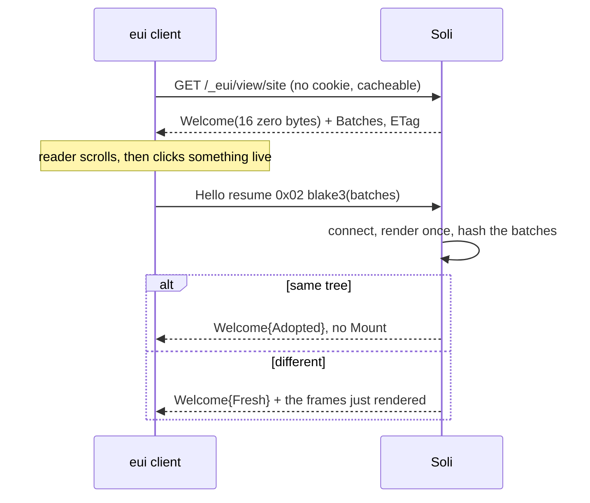

# Islands, One-Shot Renders and Resumable Sockets

The [notes-app post](/docs/blog/eui-notes-app) described EUI as it first
worked: a WebSocket per window, a server that keeps the tree it last sent, and
binary patches for the difference. That model suits an application. For a
page it is the wrong shape. It also had a weakness that had nothing to do with
pages: when the socket went, everything on the reader's screen went with it.

This cycle fixed both. A view can now be served as **one render with no
session behind it**, cached like any other `GET`. A client that fetched such a
page **keeps its tree** when it later needs the server. One corner of a page
can be live, as an **island**, while the rest stays cached. A dropped socket
**resumes** its session instead of starting over. Along the way, the server
started checking event payload shapes, and a browser opening an EUI address
now gets a page instead of a 404.

<figure style="margin:1.5rem auto;max-width:1024px;">
  
  <figcaption style="text-align:center;color:#8b949e;font-size:0.875rem;margin-top:0.5rem;">A page costs one render, an island costs one session, and a dropped socket costs only the batches it missed.</figcaption>
</figure>

## What a socket costs a reader

To send a diff, the server has to keep what it diffs against. For each reader
that means the component **instance**, an **encoder** holding the four
interned tables (atoms, styles, colours, local-handler chunks), the **whole
previous tree**, and a keyed memo on the worker that drew it.

Measured against `examples/eui-site`, that is **50–60 kB of resident memory
for a reader who is doing nothing**, linear up to four hundred sessions. The
page itself is 4 799 B, so each reader costs about twelve times the page for as
long as the window is open. On a documentation page or a catalogue the socket
buys nothing in return, because nothing there changes unless the reader
changes it.

## One render, nothing kept

A component can now be fetched as one HTTP response:

```
GET /_eui/view/<component>?v=<protocol>
Accept: application/vnd.eui.frames
```

The body is **exactly the bytes a fresh socket would have sent**: a `Welcome`,
then the `Batch` frames up to and including the first `Mount`. There is no
second encoding. A client reads it with the decoder it already has for the
socket, and frame for frame the batches match the socket's output.

Only the `Welcome` differs. Its session id is **sixteen zero bytes**, because
this body is everyone's. The response carries a strong `ETag` (the BLAKE3 of
the body), and a real handle there would give every response a different
ETag. Nothing would ever be served from cache, even though it would look
cacheable. The protocol version goes in the query string rather than a header
for the same reason: a client at version 3 and one at version 5 are owed
different bytes, so the version has to be part of the cache key.

A component opts in when it is registered:

```soli
# config/routes.sl
router_eui("site", "site#site", "site#site_view", {"static": "public, max-age=60"})
```

The string becomes `Cache-Control`. `{"static": true}` means `no-cache`, which
still revalidates against the ETag. Combining it with
`{"session": "required"}` fails where you write it, not at request time:

```
router_eui: 'site' cannot be both {"session": "required"} and {"static": ...};
a static view is rendered for nobody, so a component that needs a session has
no static first render to serve
```

"Rendered for nobody" is the contract. The render sees no session, cookie or
locale. The `GET` gets no same-origin check, because a response a CDN is
meant to hold cannot have one, so an `` on any page can reach it.
Declaring a view static promises that its `connect` is a *read*. Two renders
of the same thing must also produce the same bytes. A view that reads the
clock is still correct; it just never gets a cache hit.

The server-side risk was that small implementation choices could quietly bring
back the cost this endpoint removes. The commit names four of them:

- **Unregister the instance, don't detach it.** A detached instance is held for
  the two-minute reconnect grace.
- **Use an unbounded capture channel.** The socket's queue holds 32 frames, and
  here the task that would drain it is the one waiting on the render. A bounded
  queue deadlocks, and when the send timeout fires the reader gets a **200
  carrying a valid-looking prefix of the tree**.
- **Mint a fresh id per request**, or a reader with a socket also open collides
  with their own live session and the cleanup deletes it.
- **Use an ephemeral encoder**, so the worker's thread-local memo is never
  written.

The result: six hundred *distinct* renders, each at a different viewport so
nothing could be reused, moved resident memory by **four kilobytes**.

## A page is a route: `format.eui`

The component endpoint takes no path parameters. A doc site served through it
would be one component behind one URL, with nothing to link to and nothing to
cache per page. A doc site is a route per page, and its EUI form should be
another representation of that route. `respond_to` already chooses between
representations, so it gained `format.eui`:

```soli
# app/controllers/docs_controller.sl
def show(req)
  page = Doc.find(req["params"]["slug"])
  respond_to(req, fn(format) {
    format.html(fn() render("docs/show", {"page": page}))
    format.eui(fn() eui_render(doc_view(page)))
  })
end
```

A client asking for `application/vnd.eui.frames` gets frames, and a browser
gets HTML, at the same URL. The match is on that **exact media type, never a
substring**. A browser's `Accept` ends in `*/*`, and a looser rule would send
every browser a screenful of binary.

`eui_render(tree)` returns an ordinary response hash with an `ETag`, and a
`304` when `If-None-Match` matches. Its encoder is built and dropped inside the
call. The action is already running on a worker with an interpreter, so a page
on a route is *cheaper* to serve this way than through the component endpoint.
`eui?` asks the same question for a controller that prefers to branch by hand.

Measured against one eui-site page: **60 650 B of HTML to a browser, 296 B of
resolved interface to a client**, at one address, with a 304 on revalidation.
One gap remains: `/docs/intro.eui` still 404s, because the router does not
strip format extensions before matching. `/health.json` has the same problem,
so the gap is general, not new.

## Adopting the tree you already have (EUI 01 §2.6)

A page fetched as one render opens no socket until the reader does something
only the server can answer. When it does, the naive socket sends a `Mount`,
which discards the tree, the layout, focus, scroll offsets and anything
half-typed. A reader halfway down a page clicks something and is back at the
top.

So the client now **offers the tree it holds** in its `Hello`, as a third
`resume` tag, and the protocol went to version 5:

```
resume := 0x00                       -- nothing
        | 0x01 session:16  acked:varint
        | 0x02 tree:32
```

Soli renders `connect` as it would anyway and hashes the result. If the hashes
match, it answers `Welcome{Adopted}` and sends **nothing else**. The client
keeps its tree because nothing told it to throw the tree away. If they differ,
it answers `Welcome{Fresh}` followed by the frames it just rendered. That is
**one render either way**. When the comparison runs, the first render's frames
are already waiting in the session's own queue.

The mistake that would have broken this silently is hashing the wrong bytes.
`tree` is the BLAKE3 of the **`Batch` frames, not the body**. A one-shot
body's `Welcome` carries sixteen zeros and a socket's carries a real handle,
so a hash over the whole body could never match. The only symptom would be
that adoption never happens. Tests pin this down, and also cover the reverse
case: a refused offer must still tear the old tree down. A fresh mount numbers
batches from 1 again, and a client that kept its old sequence would drop every
new batch and show an empty window.



## Islands (EUI 01 §2.7)

Both of the above are all-or-nothing. Once one corner of a page has to be
live, the whole page becomes a session again, and every reader pays for a
comment count that changes twice a day. An **island** is a node whose
*content* comes from a session of its own:

```soli
{"k": "slot", "island": "/_eui/session/comments?for=" + page["id"].to_s, "c": [
  {"k": "text", "t": page["comment_count"].to_s + " comments"}
]}
```

The node's own children are **what shows until the island speaks**, and they
came from whatever rendered the page. That makes every failure look the same.
A client too old to know the prop, a session that can't be opened, and a page
served from a stale cache all show content that is out of date, never
missing. A live part that fails cannot take a still page down with it.

(The concept started out as a "live region". It was renamed because `live` is
already an accessibility prop and "live region" already means `aria-live`.)

Soli's half is small by design. An island is an ordinary session addressed by
an ordinary prop, so **nothing was added to the wire**. The only new thing is
that a session address may carry a query, which arrives in `connect` next to
`viewport`. That query is how two islands of the same component tell the
application which one it is rendering:

```soli
# app/controllers/comments_controller.sl
def comments(event_data)
  state  = event_data["state"] ?? {}
  params = event_data["params"] ?? {}
  # `for` arrives as a string: the query is percent-decoded, never typed.
  return {"post_id": params["for"].to_i} if event_data["event"] == "connect"
  state
end
```

The query is limited to sixteen pairs, with no nesting. Anything that needs
more structure should be a second component.

The client half landed in the EUI repository the same day. An island's encoder
starts at 1 like any other, so the client keys nodes by `(owner, id)`. An
island that names one of the page's nodes finds nothing. The client opens one
session per distinct path (query included), at most eight at a time. It
refuses anything that is not a same-origin absolute path, including
`//host/path`, which starts with a slash but names another origin. It waits
until the node is laid out **and on screen**, so a comment thread below the
fold costs nothing until someone scrolls to it.

## A socket that breaks is not an application that ended (EUI 01 §4.1)

Wifi hops, VPN reconnects and proxy idle timeouts all kill a socket while both
ends are still willing. Soli used to answer every reconnect with
`Start::Fresh`, which meant a full remount that lost scroll, focus and
half-typed text. The client had offered its session back for as long as the
protocol has had versions. Soli just never accepted.

Now a `Welcome` names the session with sixteen bytes. A client whose socket
closed without an `Error` offers them back with `acked`, the sequence of the
last batch it applied. If the session is still there, the answer is
`Welcome{Resumed}` followed by **only the batches that client missed**. No
`connect` runs, no resync, no tree. If a resume re-rendered, it would cost the
same as the reconnect it replaces.

Three details matter here.

**The handle had to change.** It used to be a digest of the cookie session id,
which identifies a *person*, and two tabs of one person share a cookie. The
handle is now minted per EUI session. Because it is a bearer credential, a
resume also requires the same cookie session, the same component, and an
instance that is still registered. Otherwise sixteen bytes would be enough to
receive somebody else's tree.

**One line was most of the bug.** On disconnect, `drop_encoder` threw away the
interned tables and the previous tree. The instance survived in the registry
for two minutes, but there was nothing left to resume into. Now the socket
detaches and a sweep frees the encoder when the same two-minute grace expires.

**Too far behind is refused.** The server keeps the last sixty-four
unacknowledged batches. A client further behind than that gets
`Welcome{Fresh}`. Telling a client it was resumed and handing it a tree with a
hole in it would be worse than a clean start, because nothing would report the
hole.

The reference client retries after 300 ms, doubling up to 30 s. It keeps its
tree until the server answers, and it re-acknowledges any replayed batch it
already applied instead of applying it twice.

## Checking the payload's shape (EUI 06 §4)

The spec asks a server to check three things about every event: the node
exists in the last tree sent, it has a handler for that event kind, and the
payload has the declared shape. Soli did the first two. A `click` carrying a
string or a thousand-element list reached the handler as if it were a pair of
coordinates.

The new check is `EventKind::payload_fits`. It lives in `eui-proto` because
payload shape is a wire-format fact shared by seven servers. It accepts an
integer where a float is expected, since a coordinate of exactly zero encodes
as an integer. A failure **drops the event** rather than ending the session:
the event may come from a client one render behind, and closing the session
would cost a person their application over a mouse movement. The spec now says
so too, and `EUI_TRACE=1` logs each drop and its reason.

## A browser at an EUI address

A browser that opens an EUI server's address used to get binary or a 404. Now
a `GET` whose `Accept` explicitly includes `text/html` gets a short page titled
*"Less for your battery to do."*, with the command to open the app built from
the request:

```bash
EUI_ALLOW_INSECURE_LOOPBACK=1 eui http://127.0.0.1:5011/   # on loopback
eui https://app.example.com/                              # anywhere else
```

The host comes from `X-Forwarded-Host` when a proxy sets it, because the
upstream `Host` is unreachable to anyone but the proxy, and this line exists to
be copied. The page is only a fallback: an application route for the same path
wins. `curl`'s `*/*` still gets the protocol's answer.

The page also dropped a claim it used to make, that EUI sends "about a third of
the data". Compressed, its fifty-row example table is **910 B as HTML against
1 491 B as EUI**, and the caption now says so. The real saving is that the
server has already done the resolution work, so each client doesn't repeat it
on every load.

## Where this leaves a page

An EUI documentation page now costs one render per cache revalidation instead
of one session per reader. It shares a URL with its HTML form, opens a socket
only when the reader does something live, keeps its scroll position when it
does, and survives a wifi hop. A live comment count no longer turns the whole
page into a session.

Two things remain open. The router does not yet understand format extensions
like `.eui`. And islands have tests on both sides, but no end-to-end run of the
client against a Soli server, because no CI has a server to run it against.

Reference: [EUI overview](/docs/eui/overview) ("Serving a page with no
session", "Islands", "A socket that breaks") and [EUI events](/docs/eui/events).
The normative text is `spec/01-transport.md` §2.4, §2.6, §2.7 and §4.1, and
`spec/06-events.md` §4, in the EUI repository.
