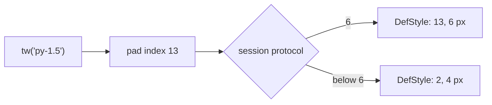

# Tailwind Classes for a UI That Isn't HTML

The [notes app](/docs/blog/eui-notes-app) wrote its styles the way the EUI
protocol reads them: `{"pad": 6, "gap": 4, "bg": "surface.base"}`. That is
exact, and it is nobody's first language. People think `px-4 py-2`. So does
every model that has read a million Tailwind components, and so, after a few
years, do your own fingers. A first-draft screen arrives written in Tailwind
whether the target is a browser or not.

EUI has no browser on the other end. There is no stylesheet, no cascade and no
media query, only a native client drawing a node tree whose styles are 64-byte
records. Since Soli 2.5 the scaffolded catalogue takes Tailwind's classes
anyway, through one function, `tw()`. It is plain Soli in the sixth catalogue
file, `eui_builders_tw.sl`, and it adds nothing to the wire. This post is about
what that translation takes, what it refuses and why the refusals matter most.
It also covers the four places where it made the protocol grow.

<figure style="margin:1.5rem auto;max-width:1024px;">
  
  <figcaption style="text-align:center;color:#8b949e;font-size:0.875rem;margin-top:0.5rem;">A class becomes a style key, a colour becomes a role, and a class with no equivalent raises.</figcaption>
</figure>

## A class is a key, a colour is a role

Here is the string from the commit that introduced it:

```soli
card = tw("flex items-center gap-3 rounded-lg bg-white px-4 py-2 shadow-sm hover:bg-gray-50")
card["s"]      # {display: row, align: center, gap: 4, radius: 2,
               #  bg: surface.raised, pad: [3, 5, 3, 5], shadow: 1}
card["hover"]  # {bg: surface.base}
```

Every value on the right is something the encoder already accepted before
`tw()` existed. That was the design constraint, and it explains most of what
follows.

**Spacing is an index, not pixels.** `gap-3` is 12 px in Tailwind and index 4
of EUI's space scale, which is also 12 px. The client multiplies the index by
the viewer's density, so it is not the same thing as `{"gap": 12}`. Tailwind's
steps and the space scale share their pixels, so the mapping is a lookup table.

**A colour is a role.** `bg-white` is not `#ffffff`. It is `surface.raised`,
the colour the viewer's theme gives a raised surface. A gray becomes a
different role depending on what it paints. As a background, `gray-50` is
`surface.base`. As a border, `gray-200` is `border.subtle`. As text,
`gray-500` is `text.muted`. `indigo-600`, `-500` and `-700` are the accent's
base, hover and active. Red, green, yellow and blue are the danger, success,
warning and info families. This is why a `tw()` screen is right in dark mode
with no `dark:` class. The client resolves every role against the current
theme, so it was never going to need one.

**A state is a delta.** `tw()` answers the resting style plus four deltas,
`hover`, `press`, `focus` and `disabled`. That is the same shape as a `TONES`
entry in the catalogue, so a `tw()` result is a tone, and every builder that
takes a tone takes one. When the string sits under a `"tw"` key on a `node`,
`row`, `column` or `stack`, the states become local handlers on the node
itself. The notes app post introduced these: small programs the client runs
without a round trip. A hover written as `hover:bg-gray-50` costs no server
event:

```soli
def order_row(order)
  row({"tw": "items-center gap-3 px-4 py-2.5 hover:bg-gray-50"}, [
    text(order["number"], tw_style("text-sm font-medium text-gray-900")),
    text(order["customer"], tw_style("text-sm text-gray-500 truncate"))
  ])
end
```

That row gets `pointer_enter`, `pointer_leave`, `pointer_down` and
`pointer_up` handlers, each swapping `self.style` for a precomputed style. A
node with no state classes gets no handlers at all. `tw_style` is the resting
style alone, for a `text` node, whose style is a plain hash.

Parsing is not free. The source puts it at a quarter of a millisecond per
string, and a view says the same string on every row of every render. So each
distinct string is parsed once per process and copied out after that. The copy
matters because `column()` writes `display` into the style it is handed, and a
shared hash would carry that write into every later node. The memo stops at
1,024 strings, so classes built from data cost one parse each and nothing more.

## Refusing is the feature

The most important line in `eui_builders_tw.sl` is a comment near the top:

> A class with no honest equivalent raises, naming the class and saying why,
> rather than being dropped: a page that silently loses half its classes looks
> almost right, which is the expensive kind of wrong.

A browser forgives an unknown class by ignoring it. That is fine in a browser,
because the class probably did something somewhere. Here, ignoring it would
mean a screen that looks 90% like the draft, with nothing to say which 10% is
missing. So every refusal names the class and gives the reason, and most
reasons point to the thing to write instead:

```
tw: 'tracking-wide' has no EUI equivalent — EUI has no letter-spacing; the 64-byte style record has no byte for it
tw: 'italic' has no EUI equivalent — the client ships no italic face
tw: 'dark:bg-gray-900' has no EUI equivalent — colours are roles and already follow the viewer's theme; drop the dark: classes
tw: 'ml-auto' has no EUI equivalent — an auto margin along the parent's line pushes its siblings away, and there are no auto margins: put spacer() before the node (ml-auto, mt-auto) or after it (mr-auto, mb-auto), or justify-between on the parent
tw: 'group-hover:bg-gray-50' has no EUI equivalent — there are no group or peer states: a local handler restyles one node, by key
tw: 'bg-indigo-50' has no EUI equivalent — the accent has base, hover and active (indigo-600, -500, -700) and no tint; bg-info-subtle is the nearest wash
```

Each refusal is a fact about the protocol, not a gap in the parser. A radius is
one byte for all four corners, so `rounded-t-lg` has nowhere to go. Margins are
unsigned bytes, so there is no `-mt-2`. There are no transforms, filters,
positioning schemes other than `absolute` inside a `stack`, or pseudo-elements.
The refusal table is the protocol's limits, written as Tailwind class names.

A few classes are taken as nothing, because EUI already does what they ask.
`select-none` is how every non-editable node behaves. `isolate` has nothing to
isolate. `outline-none`, and `outline-*` or `ring-*` under `focus-visible:`,
style a focus ring that the client draws itself: 2 px in `focus.ring`, outside
the border box, when focus came from the keyboard. Where the two scales differ
but a nearest step is honest, the approximation is written down. For example,
`rounded-md` is drawn at radius 2, and `ring-1` is a real 1 px border that
takes layout space rather than being painted over the box. The EUI repository's
`doc/docs/eui/tailwind.md` lists every approximation, so none of them has to
be found by surprise.

## Breakpoints resolve on the server

`md:flex` means "from 768 px up". A browser answers that with a media query.
The EUI client runs none. It reports its viewport, and a resize is a new
render, which it already was. So `sm:` through `2xl:` resolve on the server,
mobile first, against a width the view passes in. The rungs are Tailwind's,
at 640, 768, 1024, 1280 and 1536 px.

The width reaches the handler as `params["viewport"]`, on `connect` and again
with every `viewport` event. The handler keeps it in state like anything else:

```soli
def orders(event_data)
  state  = event_data["state"] ?? {}
  params = event_data["params"] ?? {}
  state["viewport"] = params["viewport"] unless params["viewport"].nil?
  state
end

def orders_view(state)
  viewport_width = state["viewport"]["width"]
  column({"tw": "mx-auto max-w-4xl gap-6 px-4 sm:px-6 lg:px-8", "vw": viewport_width}, [
    text("Recent orders", tw_style("uppercase text-xs font-semibold text-gray-500")),
    column({"tw": "divide-y divide-gray-200 rounded-lg bg-white shadow-sm ring-1 ring-gray-900/5"},
      state["orders"].map(fn(order) order_row(order)))
  ])
end
```

At 820 px the outer column's padding is `[0, 7, 0, 7]`, which is `px-6`. At
1,300 px it is `[0, 8, 0, 8]`. `"vw"` sits beside `"tw"` and never reaches the
style. The other two forms are `tw(classes, width)` and
`tw_style(classes, false, width)`.

The resolution order follows Tailwind's stylesheet: bare classes first, then
each breakpoint the width has reached from the smallest up, then the states.
`p-2 md:p-4` is `p-4` from 768 px whichever order you wrote them in. A class
under a breakpoint the width has not reached is still parsed, so a refused
class raises on a phone too and not only on the wide screen you forgot to test.

The part worth defending is what happens with no width. `tw("p-2 md:p-4")`
does not guess:

```
tw: 'md:p-4' needs the viewport width — a breakpoint class applies from 768 px up, and tw() was not given one: write tw(classes, width), tw_style(classes, false, width), or "vw": width beside "tw" on a node
```

Reading `md:` as "always" breaks phones. Reading it as "never" breaks desktops.
Both would pass a quick look on whichever screen the author uses. The memo
also keys on the breakpoint, not the width, so a window dragged across 300
widths makes six entries, not 300. Range variants such as `max-md:` are
refused with a note to write mobile first.

## Between children: space, divide, and case

Three families of Tailwind classes describe the children rather than the box,
and each became something EUI already draws.

**`space-x-N` and `space-y-N`** are margins on every child but the first. On a
row that does not wrap and has no gap of its own, `space-x-4` is exactly
`gap-4`, so it becomes the gap. Anywhere else it means something different,
and `tw()` says so. A `space-y` on a row puts a margin across the line, not
between the children. On a wrapping line it leaves the wrapped lines unspaced.
Next to a gap, a browser draws the sum of the two. EUI has one gap per box, so
`gap-x-4 gap-y-2` on a grid is refused too, since a grid spaces both ways:

```
tw: 'gap-x-4' has no EUI equivalent — EUI has one gap for both axes, and a grid spaces its rows as well as its columns; write gap-N, or gap-x and gap-y the same
```

Because the answer depends on which way the box runs, `tw()` alone settles
these only when its classes say which way that is, with `flex` or `flex-col`,
and raises otherwise. On a `row()` or
`column()`, `node()` settles them against the final direction.

**`divide-y`** is Tailwind's `> * ~ *` rule, a border on every child but the
first. `node()` does this directly. It copies each child after the first,
because the same hash may be a child somewhere else, and gives it a top border
in the divider's colour. With no colour it uses `border.subtle`, the gray-200
that Tailwind's preflight gives every border. In the orders list above, the
second row's style comes out as
`{..., "border": [1, 0, 0, 0], "border_color": "border.subtle"}`. The rule is
also laid onto every style its local handlers can switch to. Without that, the
rule would vanish on hover, which is the kind of bug nobody notices until a
screenshot.

**`uppercase`, `lowercase` and `capitalize`** change the string, so `text()`
applies them on the server. The label above goes out as `RECENT ORDERS`. On a
box, which has no string, the class is refused.

## Measuring the refusals: the half steps

The first version refused `py-1.5`. The space scale had 4 px and 8 px, and
6 px is neither. The refusal named the two nearest steps, which made it a
one-edit fix, but it was still a fix nobody wanted to make.

The project then measured the refusals instead of arguing about them. Over ten
first-draft screens, the classes `tw()` refused most were `1.5` (34 times),
`2.5` (14), `32` (10), `3.5` (8) and `20` (twice). `40` came up once and was
left out. EUI protocol version 6 appends those five to the space scale:

| Tailwind step | 1.5 | 2.5 | 3.5 | 20 | 32 |
|---|---|---|---|---|---|
| px | 6 | 10 | 14 | 80 | 128 |
| index | 13 | 14 | 15 | 16 | 17 |
| a client below 6 is sent | 2 (4 px) | 3 (8 px) | 4 (12 px) | 11 (64 px) | 12 (96 px) |

They are appended rather than slotted into order because a style record
carries an index. Renumbering would move every existing step under every older
client. So the scale is not sorted, and the spec says a client must not assume
it is.

The last row is the compatibility rule. A session negotiated below version 6
must never receive an index above 12. The encoder's style table, which every
`DefStyle` passes through, runs each record through
`StyleRecord::for_protocol` with the session's version. That applies on the
socket, on `GET /_eui/view?v=` and through `eui_render`. Each new step falls
back to the nearest older one, and ties go down. Four of the five sit exactly
halfway between two older steps, so the tie rule matters often. Going down
means a box is 2 px tighter than its author meant rather than 2 px wider than
the width it was given. You write `py-1.5` once for every client.



A step the scale still lacks raises as before, and names its neighbours:

```
tw: 'py-7' has no EUI equivalent — '7' is not on the space scale; the nearest are 6 (24 px) and 8 (32 px); the steps are 0, 0.5, 1, 1.5, 2, 2.5, 3, 3.5, 4, 5, 6, 8, 10, 12, 16, 20, 24, 32
```

## Gradients, pulse and bounce

The other two things protocol 6 added came from the same source: classes that
Tailwind UI screens use and EUI could not draw. A style's `bg` may now be a
gradient, and `tw()` composes one from `bg-gradient-to-*` plus `from-*`,
`via-*` and `to-*`, in any class order:

```soli
tw("bg-gradient-to-r from-indigo-600 via-info to-[#ff80b5]")["s"]
# {bg: {gradient: {to: right, stops: [[accent.base, 0], [info.base, 128], [#ff80b5, 255]]}}}
```

Stop positions are in 255ths. Unplaced stops sit at 0%, 50% and 100%, as in
Tailwind, and `from-10%`-style classes place them. The encoder defines each
distinct gradient once per session as a `DefGradient`. It is sent after any
literal colour its stops name and before the style that uses it. A client
older than 6 gets the first stop as a solid background.

One Tailwind habit is refused: `from-indigo-600` alone, or `to-transparent`.
Tailwind fades to a transparent copy of the colour, but a role has no
transparent copy, so `tw()` asks for a real `to-*` colour rather than invent
one. `animate-pulse` and `animate-bounce` join `animate-spin` as animation
bits. They combine (`animate-spin animate-pulse` is `["spin", "pulse"]`) and
run on the client's clock. A skeleton row is
`tw("animate-pulse rounded-md bg-gray-200 h-4 w-48")`, and the client needs
nothing else from the server to animate it.

## The catalogue now looks like Tailwind UI

Accepting the classes is one half. The other half is that `bg-white px-4 py-2`
should look like Tailwind UI when it is drawn. Two commits in the EUI
repository brought the client and the scaffolded catalogue there.

The client's defaults moved to Tailwind's. The text scale is now exactly
`text-xs` to `text-4xl` (base had been 15 px on a 22 px line, and is now 16 on
24). Shadows are two layers each, like `shadow-sm`, `-md` and `-lg`. The
medium radius defaults to 8 px. Inter Medium and SemiBold now ship, because
weights 1 and 2 had been drawing as regular and bold. The default palette is
seeded from indigo-600 on Tailwind's gray, and its light roles land within
ΔE 2.4 of `gray-50` through `gray-900` and the three indigos. The one
exception is `border.strong`, at ΔE 5.2 from `gray-400`, because `gray-400` is
2.5:1 on `gray-50` and the theme's contrast contract wants 3:1.

The catalogue in your app followed, with nothing new on the wire. Labels and
body text are 14 px, and field labels use the default ink rather than a muted
one. Fields and secondary buttons are white inside a `border.default`
hairline. Every button is 36 px tall. Cards use radius 2 with a small shadow,
and dialogs, menus and toasts are a step up at radius 3 and shadow 3. Tables,
badges and tabs are drawn the way Tailwind UI draws them. `soli new <app> --eui`
writes all six files, `eui_builders_tw.sl` among them. `node()` reads a
`"tw"` key through it, so the file is not optional.

The demo application in the EUI repository has a `helpdesk` component written
this way: a Tailwind UI application shell with a sidebar, a top bar, tables, a
thread and forms. It uses `divide-y`, `space-y-6`, `mx-auto`,
`px-4 sm:px-6 lg:px-8` and half steps where Tailwind UI writes them. The
spec that tests `tw()` sends one of every accepted class through the real
encoder, which raises on any key or value it does not know. That spec is how
the refusal table and the "adds nothing to the wire" claim stay true.

## What to read next

- [Styling](/docs/eui/styling), section "Tailwind classes": the mapping table,
  breakpoints and the half steps, next to the style keys they become.
- `app/controllers/eui_builders_tw.sl` in your own app. It is readable Soli,
  and every refusal's reason is written next to the class.
- `doc/docs/eui/tailwind.md` in the EUI repository, for the full list of
  classes, approximations and refusals.

The translation is only a lookup table, and the refusals matter more than the
table. It takes whatever Tailwind already means in EUI's terms. Anything else
fails loudly, and the error tells you what to write instead.
