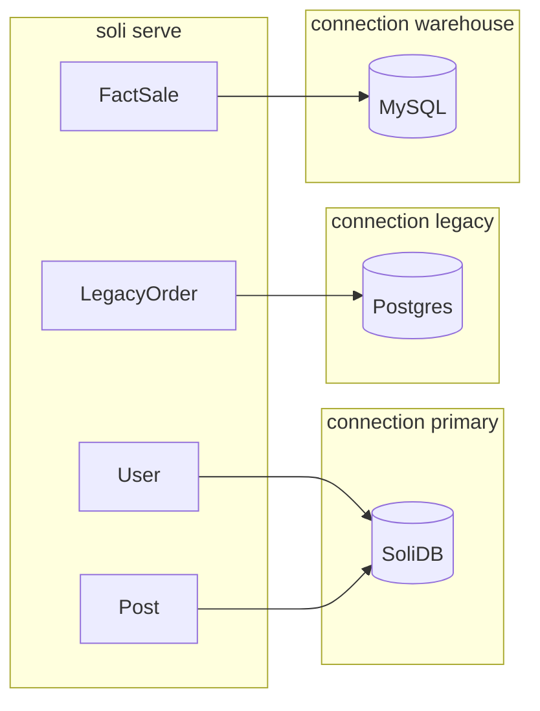

# Multiple Databases in One Soli App

Soli was SoliDB-native by design: one connection, one backend, the full ORM surface
(graph, vector, timeseries, raw SDBQL) in a single process. That is still the right
default for most apps.

It is also an adoption wall. Real shops do not empty Postgres on day one. They have
a billing warehouse on MySQL, a legacy order table on PostgreSQL, and a product
domain that deserves SoliDB's document + search stack. Forcing everything onto one
engine is how frameworks lose RFPs.

So Soli now does what Rails and Laravel already expect — **named connections**,
declared in config, **chosen per model** — without pretending every backend has the
same capabilities.

<figure style="margin:1.5rem auto;max-width:1024px;">
  
  <figcaption style="text-align:center;color:#8b949e;font-size:0.875rem;margin-top:0.5rem;">One process, three connections. Each model names where it lives; the ORM refuses to paper over the network boundary.</figcaption>
</figure>

## The problem with a single global adapter

Until now, Soli's SQL work and SoliDB work shared a process-wide switch:

```bash
# Entire app is SoliDB…
# (default)

# …or entire app is Postgres document tables
SOLI_DB_ADAPTER=postgres
DATABASE_URL=postgres://…
```

That is enough to **run** a brownfield CRUD app on Postgres or MySQL (the Phase 2/3
SQL document backend: `_key` + JSON/JSONB `doc`, hash `.where`, aggregates, batched
`.includes`, `group_by`, migrations). It is not enough to **compose** backends.

`is_sql()` was global. Every model used the same pool. Hybrid "SoliDB for product,
Postgres for legacy" was impossible without two processes.

## The shape: `config/database.toml`

Named connections live next to routes, not only in the environment:

```toml
# config/database.toml
default = "primary"

[connections.primary]
adapter = "solidb"
host = "${SOLIDB_HOST:-http://localhost:6745}"
database = "${SOLIDB_DATABASE:-default}"
username = "${SOLIDB_USERNAME:-}"
password = "${SOLIDB_PASSWORD:-}"

[connections.legacy]
adapter = "postgres"
url = "${LEGACY_DATABASE_URL}"
pool = 10

[connections.warehouse]
adapter = "mysql"
url = "${WAREHOUSE_DATABASE_URL}"
pool = 5
```

`${VAR}` and `${VAR:-default}` expand from the environment after `.env` loads, so
secrets stay out of git while the **topology** of the app stays reviewable.

If the file is missing, nothing breaks: env alone still defines a single connection
named `primary`. Existing apps keep working.

## The API: one line on the model

```soli
class User < Model
  # uses default ("primary") — SoliDB in the example above
end

class LegacyOrder < Model
  connection "legacy"
end

class FactSale < Model
  connection "warehouse"
end
```

That class-body DSL mirrors `soft_delete`, scopes, and indexes: registered at
model load, stored on metadata, inherited by STI children unless redeclared.

From there the runtime does the boring, important work:

1. Resolve the connection name (model → collection map, or registry default).
2. Activate it for the duration of the query or write.
3. Use a **per-name SQL pool** (Postgres/MySQL), not one process-wide `OnceLock`.
4. Fail loudly if you ask for a connection that is not in the file.

## What works on SQL (honest matrix)

SQL adapters are a **document subset**, not a secret second SoliDB.

| Capability | SoliDB | Postgres / MySQL docs |
|------------|--------|------------------------|
| CRUD, validations, callbacks | ✓ | ✓ |
| Hash `.where` / order / limit / count | ✓ | ✓ |
| sum / avg / min / max | ✓ | ✓ |
| Batched `.includes` (belongs_to / has_many / has_one) | ✓ | ✓ |
| Multi-row `group_by` | ✓ | ✓ |
| HABTM / through includes, `.having`, `.join` | ✓ | ✗ |
| Graph, vector (pgvector later), columnar, timeseries | ✓ | ✗ |
| `Model.transaction` | ✓ | ✗ |

The point of the matrix is product trust. Silent half-support is how people learn
to hate multi-DB features.

## The rule that keeps you honest: no cross-connection includes

```soli
# LegacyOrder is on Postgres. User is on SoliDB.
LegacyOrder.includes("user").all
# → error: spans database connections ("legacy" → "primary")
```

You can still store a foreign key. You cannot pretend a join across two network
services is free. Fetch each side deliberately, or put both models on the same
connection when they are a true aggregate.

That is deliberate. Distributed joins and 2PC are out of scope. The feature exists
to **place** models, not to invent a federated database.

## Migrating data onto SQL

For the brownfield path, import is a first-class command:

```bash
SOLI_DB_ADAPTER=postgres DATABASE_URL=postgres://…
SOLIDB_HOST=… SOLIDB_USERNAME=… SOLIDB_PASSWORD=…
soli db:import posts users
```

Each SoliDB document becomes a row in a `_key` + `doc` table. Same shape the Model
layer already uses on SQL. No relational schema reverse-engineering step for the
document case.

## Mental model vs Rails / Laravel

| | Rails | Soli |
|--|-------|------|
| Config | `database.yml` + env | `config/database.toml` + env expansion |
| Per-model | `connects_to` / `establish_connection` | `connection "name"` |
| Default | `primary` | `primary` (or `default =` in TOML) |
| Hybrid engines | Multiple adapters | SoliDB **and** Postgres/MySQL in one process |
| Cross-DB associations | Usually discouraged | Hard error on eager load |

The killer case for Soli is not "five Postgres shards." It is **SoliDB for the
product core + SQL where the data already lives**.



## What we are not shipping yet

Honesty beats a roadmap slide:

- **Per-connection SoliDB hosts** — the registry knows the fields; routing every
  SoliDB HTTP/driver call through the active named host is the next wiring step.
- **`soli db:migrate --connection warehouse`** — migrations still target the
  default connection until that flag lands.
- **Request-scoped roles** (`writing` / `reading` replicas) — Rails multi-db
  middleware territory; not v1.
- **pgvector on the document store** — still SoliDB-only (or a later dedicated
  design), not a pretend checkbox.

## Getting started

1. Keep using env-only `primary` if one database is enough.
2. When you need a second engine, add `config/database.toml` and name both.
3. Mark only the models that truly live elsewhere:

```soli
class BillingInvoice < Model
  connection "legacy"
end
```

4. Read the capability matrix before you move graph or vector features off SoliDB.

## Why this fits Soli

Soli's bet has always been **minimum surface, maximum utility**. Multi-database
does not invent a new ORM dialect. It reuses the Model API you already know, puts
topology in a file you can code-review, and refuses the lies that make multi-DB
features toxic (silent cross-DB joins, "transactions" that are not).

One process. Named connections. Per-model choice. SoliDB where it shines; SQL
where the data already is.

Design notes and the full matrix live in
[`docs/sql-adapter-design.md`](/docs) (repo: `docs/sql-adapter-design.md`).
