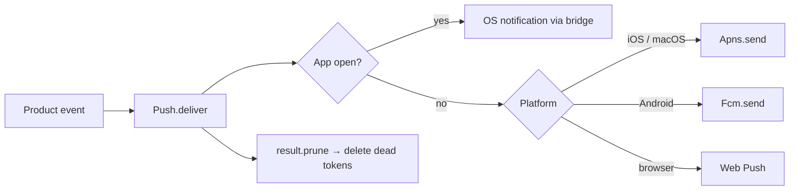

# Ship a Native Mobile App Without Rewriting the Stack

You already have a Soli app: models, controllers, LiveView, HTMx, auth, jobs.
Someone asks for **the phone version** — home-screen icon, OS notifications when
the app is closed, camera for a QR scan, deep links that open *in the app*, not
Safari or Chrome.

The usual answers are heavy. Rebuild in React Native or Flutter. Split into a
JSON API plus a separate client. Invent a second release train. Spend a quarter
before the product feels like the web one again.

Soli takes the other route: **the same app**, wrapped in a thin native shell
that is a real `WebView` / `WKWebView` onto your deployment, with a bridge for
everything the web view does not own.

```
[ iOS shell  · UIKit + WKWebView ]
[ Android shell · native WebView ]
        │
        │  loads your deployed Soli app
        ▼
[ same models · same templates · same LiveView ]
[ Native bridge · Push.deliver · AppLinks     ]
```

<figure style="margin:1.5rem auto;max-width:1024px;">
  
  <figcaption style="text-align:center;color:#8b949e;font-size:0.875rem;margin-top:0.5rem;">Same product in the shell. Native only where the web view cannot go.</figcaption>
</figure>

## What problem this solves

A Soli web app already *is* a full product. The missing piece for mobile is not
another language — it is **packaging and OS integration**:

- An icon on the home screen and a store listing
- Notifications when the process is dead (Doze / suspended)
- Camera, biometrics, share sheet, haptics, NFC where the hardware has them
- `https://your.app/pings/3` opening the app instead of a browser tab

`clients/ios` and `clients/android` are that packaging. They are not a second UI
framework and not a second backend. They load the deployment you already run.

If your mental model is "Hotwire Native / Capacitor with the Soli stack," you
are close. The difference is that Soli owns the **server half** of the hard
bits — signed native channels, `Push.deliver` routing, `AppLinks` proof files —
so the shell stays thin and the product logic stays in Soli.

## Mobile is not desktop in a smaller window

[`soli desktop build`](/docs/blog/desktop-build) freezes the whole stack into
one executable: encrypted app, private SolidB, loopback server. That model does
**not** transfer to phones.

| | Desktop artifact | Mobile shell |
|---|---|---|
| Process | Bundled Soli + SolidB | Thin native WebView |
| Data | Local private database | Your server / SolidB |
| Updates | Signed OTA channel | Deploy the server; store for shell |
| Why | Offline / local product | Always-online product with OS chrome |

iOS will not let you ship a general-purpose server next to a WebView the way
desktop does. Android can host more, but Soli's mobile path is deliberate: the
shell is a **client onto the remote deployment**. Ship product changes by
deploying Soli. Ship shell changes (permissions, bridge, icons) through the
store when you must.

That split is the whole product story. Most "mobile work" is product; product
lives in Soli. Store releases stay rare.

## What is inside the shell

```
[ native window + icon + splash ]
[ WebView / WKWebView            — renders your Soli pages ]
[ bridge inject                  — window.soli.native*     ]
[ OS permissions                 — camera, location, push  ]
[ deep link handlers             — scheme + universal link ]
```

Working shells live under `clients/ios` (UIKit + `WKWebView`) and
`clients/android` (system `WebView`). They inject a small host object the client
script looks for; the page never sniffs user agents for features:

```js
window.soli.nativeBridge
// { available: true, platform: "android",
//   capabilities: ["notify", "geolocation", "vibrate", "share",
//                  "keep_awake", "print", "clipboard", "camera",
//                  "nfc", "biometric"] }
```

A capability appears in that list only when it actually works on that shell.
Feature-detect; do not guess from `navigator.userAgent`.

## The bridge rule (two lines)

1. **Prefer the web API when the host already has one.** Camera is
   `getUserMedia`, not `Native.camera(...)`. The shell's job is permission
   wiring so the promise is not a silent `NotAllowedError`.
2. **Bridge only what the embedded web view cannot do.** Notifications and the
   Push API are reserved for the *browser* proper — neither `WKWebView` nor
   Android's `WebView` implements them. That is why open-app OS notifications
   go through the bridge.

```soli
# Server: reach whoever is looking at the app right now
Native.notify("user:#{str(user_id)}", {
  "title": "New ping",
  "body":  "Ana replied to your comment",
  "url":   "/pings/3"
})
```

In a shell that raises a real OS notification. In a browser it can fall back to
Web Notifications. Where neither is available it does nothing.

One line in the layout turns the channel on for the current user:

```erb
<% user_id = session_get("user_id") %>
<%- native_channel("user:#{str(user_id)}") rescue "" unless user_id.nil? %>
```

That emits a signed meta tag. Subscribing is a browser `GET`, so the channel
travels as an HMAC token keyed from `SOLI_SESSION_SECRET` — not plain
`?channel=user:42`. Without the secret, `native_channel` raises rather than
shipping an unsigned tag.

## Open app vs closed app

The bridge only reaches a client that has the app open. A closed (or Doze'd)
phone is not executing your JavaScript, so something else has to listen:

| Client | App open | App closed |
|---|---|---|
| Browser / PWA | bridge or Web Notification | Web Push (VAPID) |
| iOS shell | **bridge** | **APNs** |
| Android shell | **bridge** | **FCM** |

You rarely branch on that matrix yourself. `Push.deliver` is the cascade:

```soli
result = Push.deliver("user:#{str(user.id)}", {
  "title": "New ping",
  "body":  "Ana replied",
  "url":   "/pings/3",
  "badge": 3
}, {
  "targets": user.push_targets(),   # [{platform, token|subscription}, ...]
  "apns":    { "key": apns_key, "key_id": "…", "team_id": "…", "topic": "net.example.app" },
  "fcm":     { "service_account": firebase_account }
  # VAPID from VAPID_* env when not passed
})
```

It tries the bridge first (free, no push service), then falls through to the
right closed-app transport per target. The framework cannot own your device
list — that is your schema — but it owns ordering, routing, and dead-token
detection. Act on `result["prune"]`: tokens the service reported gone
(`410` / `UNREGISTERED`) should be deleted, or the store grows forever.



Low-level senders (`Native.notify`, `Apns.send`, `Fcm.send`, VAPID) stay
available when you want one transport only. Day to day, call `Push.deliver`.

## Device capabilities without a second app

Everything else follows the same "web API or bridge" rule:

| Call | What it does on phone |
|---|---|
| `getUserMedia` / `camera_preview` | Camera once the shell grants capture |
| `soli.nativeBridge.share(...)` | System share sheet |
| `soli.nativeBridge.authenticate(...)` | Face / Touch ID / biometrics (local confirm, not server auth) |
| `soli.nativeBridge.vibrate(...)` | Haptics |
| `soli.nativeBridge.badge(n)` | Icon badge (Android: via a silent carrier notification — honest ceiling) |
| `soli.nativeBridge.readTag()` | NFC id (Android / Core NFC on iOS) |
| `soli.nativeBridge.keepAwake(true)` | Keep the screen on for a flow |

```js
if (soli.nativeBridge.supports("nfc")) {
  const id = await soli.nativeBridge.readTag()
}
```

Biometrics confirm the person holding the device. They are **not** a login
credential — use WebAuthn when you need proof for the server. Camera tracks are
stopped when a `camera_preview` element leaves the DOM, so instant navigation
does not leave the green indicator on after the user has moved on.

Full matrix: [Native Bridge](/docs/development-tools/native-bridge) and
[Device Capabilities](/docs/native/device).

## Deep links that actually land on the page

A deep link has two halves that must agree. Get either wrong and the OS
silently opens the browser — no error, just a confused user.

1. **Host** proves which apps may claim the domain (`AppLinks`).
2. **Shell** declares the schemes / hosts and routes the URL into the WebView.

```soli
# config/routes.sl
get("/.well-known/assetlinks.json",            "well_known#android")
get("/.well-known/apple-app-site-association", "well_known#apple")
```

```soli
def android(req)
  {
    "headers": { "Content-Type": "application/json" },
    "body": AppLinks.android("net.example.myapp", [ENV["ANDROID_CERT_SHA256"]])
  }
end

def apple(req)
  {
    "headers": { "Content-Type": "application/json" },
    "body": AppLinks.apple("TEAMID.net.example.myapp", ["/pings/*", "/threads/*"])
  }
end
```

`AppLinks` normalizes Android fingerprints to the colon-separated form Google
matches, and emits both modern and legacy Apple path forms so one file works
across OS versions. The Apple file **must** be `application/json`, no redirect,
and **no** `.json` extension on the path — Apple's CDN is unforgiving.

| Kind | Looks like | Needs |
|---|---|---|
| Universal / App Link | `https://app.com/pings/3` | Host proof file + paid Apple account for Universal Links |
| Custom scheme | `myapp://pings/3` | Manifest / URL types only — works on free / ad-hoc signing |

Prefer the https form for product links (install → app, no install → site).
Keep the custom scheme for QR codes and email buttons while verification is
warming up. Notification `url` values ride the same routing once the shell is
open.

## What you still pay for (honestly)

Native packaging does not remove platform bureaucracy. Be explicit with yourself
and your users:

**You still need (for a full store product):**

- An Apple Developer account for push, Universal Links, and NFC entitlements on
  iOS (custom-scheme deep links and many device APIs work with free
  provisioning; the three big entitlements do not)
- A Firebase / Google Cloud project and service account for FCM; the Android app
  still needs the Firebase SDK to *obtain* a device token (the Soli **sender**
  is in-tree; registration is still a Gradle concern)
- Store listings, signing keys, privacy nutrition labels, permission strings in
  the shell plists / manifest
- Your own table of push targets per user — Soli routes them, it does not invent
  them

**You do not need:**

- A second UI rewrite in SwiftUI / Jetpack Compose for every screen
- A parallel JSON API only the mobile client understands (you can still expose
  APIs; you are not forced to)
- VAPID keys *inside* the shell for open-app notifications (that is the bridge)
- A separate product backend — deploy Soli, the shell loads it

## PWA first, shell when you must

On iOS especially, a home-screen PWA is stronger than people remember: push
(16.4+), camera, geolocation, without a store build. Ship the PWA path when the
product fits. Graduate to the native shell when you need:

- Closed-app reliability that only APNs / FCM give you under real OS policy
- NFC, stronger biometrics UX, or launcher badge behavior you care about
- Universal Links that *must* open the app
- Store distribution for customers who will not "Add to Home Screen"

The Soli app is the same either way. The shell is an optional distribution
shape, not a fork of the product.

## A minimal product checklist

```bash
soli generate devices
soli generate app_links --android-package … --apple-app-id …
soli generate client ios --url https://… --bundle-id … --team-id …
soli generate client android --fcm --url https://… --package …
# optional flaky-radio outbox:
soli generate offline
```

1. **One deployed Soli app** the shells can point at (HTTPS, stable origin).
2. **`SOLI_SESSION_SECRET`** (32+) so `native_channel` can sign tokens.
3. **Layout:** `csrf_meta_tag` + `native_channel` for authenticated users.
4. **Tokens:** shells POST `/devices` after login, or `soli.nativeBridge.registerDevice(...)`.
5. **`deliver_to_user` / `Push.deliver`** with APNs / FCM / VAPID credentials; **prune** dead tokens.
6. **`AppLinks`** well-known routes (generator or hand-written).
7. **Shell projects** under `clients/*` with host, schemes, permission strings.
8. **Feature-detect** via `soli.nativeBridge.supports(...)`.
9. Honest ops docs: free vs paid Apple entitlements; FCM still needs Gradle + `google-services.json`.

Full reference: [Native clients](/docs/native/clients), [Devices](/docs/native/devices),
[Native Bridge](/docs/development-tools/native-bridge).

## The short version

Native mobile with Soli is not "rewrite the app in Kotlin and Swift." It is the
Soli product you already ship, loaded in real iOS and Android WebView shells,
with a bridge for open-app OS work and `Push.deliver` / `AppLinks` for the parts
that only the platforms can do.

Desktop freezes the stack into a local executable. Mobile keeps the stack on
your server and freezes only the chrome. Same language, same models, same
templates — different distribution shape, and an honest map of which transport
reaches a phone that is looking versus one that is not.

Build the product once. Point a shell at it. Notify with one cascade. Deep-link
with proof files that match what the OS actually checks.

Full reference:

- [Native Bridge](/docs/development-tools/native-bridge)
- [Notifications](/docs/native/notifications)
- [Apple Push (APNs)](/docs/native/push-apple)
- [Android Push (FCM)](/docs/native/push-android)
- [Deep Links](/docs/native/deep-links)
- [Device Capabilities](/docs/native/device)
- [Desktop Applications](/docs/development-tools/desktop) — the local counterpart
