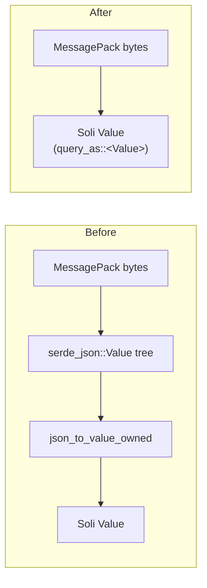

# Decoding Rows Once: the Native SoliDB Driver, in Every Build

A database read in Soli ends as a Soli value: an array of hashes that a template
loops over or `render_json` serialises. Until v2.5, a read that went over
SoliDB's native driver built each row in full as a different kind of value first,
and only then converted it. The rows arrived as MessagePack, were decoded into a
`serde_json::Value` tree, and that tree was walked a second time to produce the
Soli value the controller actually wanted.

That middle step turned out to be most of the cost. A profile of the framework
benchmark's `/db-template` route put decoding the response at **35–40% of Soli's
CPU** for the route. The interpreter itself was **under 1%**. The page was
spending its time on bookkeeping, not on running the controller or the template.

Two commits change that. The first makes plain reads decode their rows once,
straight from the wire into Soli values. The second puts the driver that path
lives on into every build, which it never was. Until then `SOLI_DB_DRIVER=1` on a
published binary did nothing at all. A third commit is about testing it: CI now
runs a real SoliDB to test against. That took one more attempt than planned,
because the published SoliDB image does not start.

<figure style="margin:1.5rem auto;max-width:1024px;">
  
  <figcaption style="text-align:center;color:#8b949e;font-size:0.875rem;margin-top:0.5rem;">The row used to be built twice, once as JSON and once as Soli. Now it is built once.</figcaption>
</figure>

## Two transports behind one model layer

Soli's model layer can talk to SoliDB in two ways. The default is HTTP: a query
goes to the cursor endpoint as a JSON payload and comes back as a JSON body. The
other is SoliDB's own driver protocol. SoliDB serves three protocols on one port
and tells them apart by magic bytes in its accept loop. The driver protocol is
MessagePack with a 4-byte length prefix, sent over a persistent, authenticated
connection. In Soli each worker thread holds its own client, with a pool of five
sockets. That matches the reqwest pool the HTTP path uses, so when the two are
compared the difference comes from the protocol and not from how many connections
each one opens.

The driver exists because of a benchmark. On the framework suite, Soli lost the
write rows to Phoenix, and the cause was the transport: Soli's inserts went out as
HTTP requests while Ecto's went down a pooled binary connection. The module's own
notes (`src/solidb_driver.rs`) record the driver protocol at 2.2x HTTP on inserts
and 3.8x on single-document reads when measured standalone. For queries, once
SoliDB's driver handler got the same prepared-statement and result caches that the
HTTP cursor handler already had, it measured 1.40x the throughput on under half
the server CPU.

So the driver was already the fast transport. It was still paying for a conversion
it didn't need.

## The old path: one row, built twice

Here is what a plain read on the driver did before this change, in
`exec_auto_collection`:

1. `solidb-client` read the MessagePack response and decoded each row into a
   `serde_json::Value`: a tree of `Map`s, `Vec`s and `String`s allocated on the
   heap.
2. The model layer took those rows and ran `json_to_value_owned` on each one,
   walking the tree again to build a Soli `Value`, with its own reference-counted
   arrays and hashes.
3. The JSON tree was then dropped.

Count the client's internal buffering as well and the commit message puts it at
**four copies of every row**. For a 50-row read, which is what the benchmark does,
that is a lot of allocation to produce an array the template reads once.

Nothing required the `serde_json::Value` step. The rows come off the wire as
MessagePack, not JSON, and what the controller wants is a Soli value. JSON was
only the format both ends of the ORM happened to share.



## The new path: ask serde for the type you want

Soli's `Value` already implements serde's `Deserialize`, in
`src/interpreter/value_json.rs`. It was written so that JSON parsed with sonic-rs
could skip the intermediate tree. `visit_i64` produces `Value::Int`, `visit_str`
produces `Value::String`, a sequence becomes a `Value::Array`, and so on. Serde
visitors don't depend on the format, so the same visitor can read MessagePack
unchanged.

The missing piece was on the client side. `solidb-client` v1.2.0 (pinned at
`ef1679bb`) added a single-pass response decode and a generic `query_as::<T>()`,
which lets the caller choose the row type. The new driver function is short:

```rust
pub fn try_query_values(
    sdbql: &str,
    bind_vars: Option<std::collections::HashMap<String, Value>>,
) -> Option<Result<Vec<crate::interpreter::value::Value>, String>> {
    if !query_enabled() {
        return None;
    }
    // ...
    with_client(move |client| {
        block_on_db(async move {
            client
                .query_as::<crate::interpreter::value::Value>(&db, &q, bind_vars, cache)
                .await
                .map_err(|e| format!("driver query failed: {e}"))
        })
    })
}
```

`exec_auto_collection` and `exec_auto_collection_with_binds` now try this first,
through a new `exec_values_with_auto_collection`. If the driver can take the query,
the rows arrive as Soli values and are wrapped in an array. If it can't, the call
falls back to the old JSON path, which is unchanged. The query log still
records the query, its binds and its duration either way.

One detail is in the error handling. When the collection doesn't exist yet, the
old path creates it and retries. The new path doesn't duplicate that. On a
missing-collection error it hands the query to the JSON path, which creates the
collection and runs the query again. The fast path is only ever the first attempt,
and it never replaces the behaviour behind it.

## Which reads qualify

The fast path is only used when all of these are true:

| Condition | Why |
|---|---|
| `SOLI_DB_DRIVER=1` and the driver connected | HTTP responses are JSON text; that path is unchanged |
| `SOLI_DB_DRIVER_QUERY` is not `0` | that flag keeps queries on HTTP, so there is no driver query to decode |
| The model is on SoliDB, not a SQL adapter | SQL adapters have their own row path |
| No mock is registered for the query | `Model.mock_query_result` rows are JSON and are returned as-is |
| The read is not hydrated into model instances | see below |

The last row matters most. The fast path runs wherever the ORM calls
`exec_auto_collection`, which it does for reads that return plain hashes rather
than model instances. The query builder decides this in `hydration_class()`: a
builder with `pluck_fields` set returns no class, so `pluck(...).all` gives hashes
and takes the fast path. The same function also runs the builder's count, exists,
aggregate, group-by and time-bucket queries.

A hydrated read turns each row into an instance of your model class, and that
code still works from JSON. `json_doc_to_instance_owned` takes a
`serde_json::Value`, and for single-table inheritance it looks at the document's
`_id` to choose the subclass. So `Post.where(...).all`, which returns `Post`
instances, still goes through the JSON tree. So does `Post.all`: the static
`Model.all` builds instances through `exec_auto_collection_as_instances`, which
this change didn't touch. (The changelog entry lists `Model.all` among the reads
that qualify. The source says otherwise.)

Reads inside a `grouped(fn() { … })` block don't qualify either. `grouped` solves a
different problem: it combines several reads into a single `LET … RETURN […]`
request, which saves round trips. Its per-query transforms receive their rows as
`Vec<serde_json::Value>`, so the decode is unchanged there. The two optimisations
don't overlap. One removes round trips and the other removes a copy, and a
coalesced read doesn't get the second yet.

In practice, the read that benefits is a projection that goes straight to a
template or to JSON, which is also the most common shape for a list page:

```soli
class Post < Model
end

# A projection: plain hashes, not Post instances, so it takes the
# single-decode path when SOLI_DB_DRIVER=1.
title_rows = Post.pluck(:title, :views).all
print(title_rows)

# Hydrated: Post instances, built from the JSON rows as before.
popular_posts = Post.where({"views": 14}).all
print(popular_posts.length)
```

We ran a copy of this against a local SoliDB with `SOLI_DB_DRIVER=1` and two
documents seeded. The first `print` showed `[{title => Second post, views => 14}, {title => First post,
views => 7}]`. The row order is SoliDB's scan order, because the query has no
`order`. Nothing in the program's output shows which decode path ran, and that is
the intended result. The commit reports the benchmark output as byte-identical,
key order included, and the new integration test described below checks that
the two paths produce equal values.

## The numbers

These come from the commit (`50756c71`), not from a new measurement for this
post. The setup was the framework suite at 200 concurrent connections, fat-LTO
builds, median of three runs. Both routes read the same 50 posts with
`Post.pluck(:id, :title, :views).all`. `/db` sends them through `render_json` and
`/db-template` renders them through an ERB template and layout.

| Route | Before | After | CPU per request |
|---|---:|---:|---:|
| `/db` | 59.9k req/s | 79.3k req/s | 123 → 85 µs |
| `/db-template` | 57.7k req/s | 74.9k req/s | 125 → 89 µs |

Those figures include both halves of the work: the client's own single-pass
decode in solidb-client v1.2.0, and Soli asking it for `Value` rows directly. The
commit doesn't separate the two. The `/db-template` result also recovers a
slowdown of a few percent that the route had picked up since v2.3.7, where it
measured 60.8k.

The benchmark reads 50 small rows, each with three fields. The more rows a read
returns, the more of its time goes to decoding, so a larger result set should
benefit at least as much. That is an expectation, not a measured result.

## Why the driver used to be missing

Everything above had a problem: until 3833ba0e, nobody running a release could
use it.

`solidb-driver` is a Cargo feature, and it was not in the default set. The
reason was a build dependency. `solidb-client` isn't published to crates.io, so
Soli pulled it in as a **path** dependency on a SoliDB checkout next to the Soli
one. Enabling that by default would have broken `cargo install --path .` for
anyone without the SoliDB repo in the right place. So the feature stayed off, and
the only people who had the driver were the ones building both repos
side by side.

The failure was silent. `SOLI_DB_DRIVER` is read at runtime, and a binary
compiled without the feature simply has no driver for it to enable. Setting
`SOLI_DB_DRIVER=1` on a release binary left the model layer on HTTP, with no error
and no log line.

What changed is small. `solidb-client` is now a **git** dependency on the
SoliDB repository, and `Cargo.lock` pins the revision, so any build can fetch it.
With the reason for keeping it off gone, `solidb-driver` joined the default
features. Release binaries, the Docker image and `cargo install` all include it.
The `full` feature, which used to mean "default set plus the driver", is now just
an alias for the default set.

## Turning it on

The runtime default is **unchanged**. Having the driver compiled in doesn't mean
it is used. A server keeps speaking HTTP to SoliDB until you opt in:

```bash
SOLI_DB_DRIVER=1 soli serve .
```

The driver uses the same `SOLIDB_HOST` as the HTTP path, minus the scheme, since
it speaks raw TCP on the same port. It uses the same credentials:
`SOLIDB_API_KEY` if set, otherwise `SOLIDB_USERNAME` / `SOLIDB_PASSWORD`,
otherwise `admin` / `admin` as a local-development default. Both variables are
now in the configuration reference, where they were missing before:

| Variable | Effect | Default |
|---|---|---|
| `SOLI_DB_DRIVER` | `1` routes document CRUD and queries over the driver, with plain reads decoded straight into Soli values | unset (HTTP) |
| `SOLI_DB_DRIVER_QUERY` | `0` keeps queries on HTTP while CRUD uses the driver | queries on the driver |

Three behaviours are worth knowing before you enable it in production:

- **A `https://` host is refused.** The driver has no TLS, and it won't quietly
  send over plaintext what you configured as encrypted. In that case the model
  layer stays on HTTP.
- **A failed connection is remembered per worker.** If a worker can't connect or
  authenticate the first time it tries, it logs
  `[solidb_driver] …; falling back to HTTP` and stays on HTTP for the rest of its
  life, instead of retrying a dead endpoint on every query.
- **The database has to exist before the first connection.** Authentication is
  scoped to `SOLIDB_DATABASE`. Running the snippet above against a database that
  didn't exist yet printed `driver auth failed: … Database 'blog_probe_tmp' not
  found …; falling back to HTTP`. The script still worked, over HTTP. The next run,
  with the database created, used the driver. For a server this means the database
  should exist before the workers start.

The design rule, from the module's header, is that enabling the flag *can only
change the transport, never the semantics*. Anything the driver doesn't handle
returns `None`, and the caller takes the HTTP path.

## Testing it against a real server

A fast path that decodes a different value from the slow path is a bug, not an
optimisation. It is also hard to catch with mocks, because the mocks return JSON
and go through the old path. So `tests/solidb_driver_test.rs` runs against a real
SoliDB. It creates a test database and a collection, and inserts five documents
that cover what a row can contain: integers, floats, strings, arrays, nested
objects and nulls. Then it runs one query two ways:

- `try_query` (the JSON path), with each row converted by `json_to_value`
- `try_query_values` (the new path)

It asserts that the two agree row by row. It then calls
`exec_auto_collection` directly and asserts that the ORM entry point returns the
same rows, which shows that the ORM actually takes the new path and not only that
the function exists.

Without a server, the test skips. Under `SOLI_REQUIRE_DB=1` a skip becomes a
failure. That is the rule CI already applied to the Postgres and MySQL adapters,
because a skipped test in cargo still reports `ok`, and a run without a database
looks exactly like one that tested it.

Getting CI to provide that server took two commits. The first attempt added a
service container, `ghcr.io/solisoft/solidb:v1.1.0`. It never started. The image
contains a binary built against glibc 2.39 on a `debian:bookworm-slim` base, which
has glibc 2.36, so the binary exits immediately with ``version `GLIBC_2.39' not
found``, and the test job failed before running a single test.

The fix in 8898f330 doesn't use the image. The v1.1.0 **release tarball**'s binary
runs directly on the runner, because `ubuntu-latest` has glibc 2.39. A workflow
step downloads it and starts it on port 16745, then polls `/_api/health` for up to
60 seconds and prints the server log if it never becomes healthy. The port is
16745 rather than SoliDB's usual 6745 or the spec runner's 6799, so no other test
that probes those ports ends up talking to this server by accident.

The step also passes `--host 127.0.0.1` explicitly. SoliDB loads a `.env` from any
parent directory, and on the author's machine one of those files sets
`SOLIDB_HOST` to a *client* URL. The server read that as its listen address and
failed with "failed to lookup address information". It is a local-only problem,
but the fix is one flag, and the workflow step now works the same way when run
by hand.

The commit records that the step script, taken out of the workflow and run
unchanged, starts the server locally and that the driver test passes against it
with `SOLI_REQUIRE_DB=1`. The published image itself still needs fixing in the
SoliDB repository.

## What's left

The fast path covers plain reads. Two paths still build a JSON tree first:
hydrated reads, because instance construction and STI subclass resolution work
on `serde_json::Value`, and coalesced reads inside `grouped`. Both could be
moved to Soli values the same way, and neither has been yet. Meanwhile, if a
controller only needs a few fields for a list, `pluck(...).all` with
`SOLI_DB_DRIVER=1` is now the cheapest read Soli has. You can turn it on with a
release binary.
