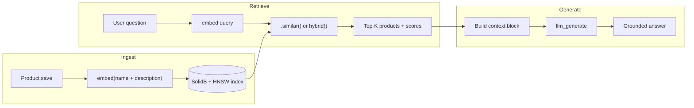

# RAG Product Discovery: Search Your Catalog, Then Let the LLM Answer

Keyword search finds "waterproof" when the user types "waterproof." It does not find hiking boots when they ask for "something durable for rainy trail walks." A bare LLM will happily invent products, prices, and SKUs that do not exist in your catalog.

**Retrieval-Augmented Generation (RAG)** fixes both problems: retrieve real products first, then generate an answer grounded in what you actually sell. In Soli there is no `rag()` builtin and no LangChain dependency — you compose three primitives that already live in the framework:

| Phase | API | What it does |
|-------|-----|--------------|
| **Ingest** | `embed()`, `embed_batch()` | Turn product text into vectors on save |
| **Retrieve** | `.similar()`, `Model.hybrid()` | Rank products by meaning (and optionally keywords) |
| **Generate** | `llm_generate(system, user)` | Summarize only from retrieved context |

Same database, same MVC app, same deployment. No separate vector service.

<figure style="margin:1.5rem auto;max-width:1024px;">
  
  <figcaption style="text-align:center;color:#8b949e;font-size:0.875rem;margin-top:0.5rem;">Ingest with <code>embed</code>, retrieve with <code>.similar()</code> or <code>hybrid()</code>, generate with <code>llm_generate</code> — the full RAG loop inside one Soli stack.</figcaption>
</figure>

## The RAG pipeline

At a high level, every RAG application follows the same shape:



1. **Ingest** — When a product is saved, `embed()` turns its name and description into a 1536-dimensional vector. SolidB stores it with an HNSW index for fast approximate nearest-neighbor search.
2. **Retrieve** — The user's question is embedded (or passed to hybrid search), and the top-K matching products come back with relevance scores.
3. **Generate** — Those products are formatted into a context block and passed to `llm_generate`. The model answers *only* from that context — real names, real prices, no hallucinated inventory.

## Step 1: Model and indexes

Declare both a vector index (for semantic search) and a fulltext index (for hybrid search when users type exact product names):

```soli
# app/models/product.sl
class Product < Model
  vector_index "embedding", dimension: 1536, metric: "cosine"
  fulltext_index "name", "description"

  before_save fn() {
    this.embedding = embed(this.name + ". " + this.description)
  }
end
```

`before_save` is the ingest hook: every create or update automatically refreshes the embedding. No separate indexing worker.

### Migration

```soli
# db/migrations/20260709000000_create_products.sl

def up(db)
  db.create_collection("products")
  db.create_vector_index("products", "embedding_idx", "embedding", 1536, {
    "metric": "cosine"
  })
  db.create_index("products", "products_fulltext", ["name", "description"], {
    "type": "fulltext"
  })
end

def down(db)
  db.drop_vector_index("products", "embedding_idx")
  db.drop_index("products", "products_fulltext")
  db.drop_collection("products")
end
```

In development, declared indexes are also reconciled at boot via `soli db:indexes`. Migrations remain the recommended production path.

### Seed the catalog

```soli
# db/seeds/products.sl

let catalog = [
  {
    "name": "Trail Blazer Hiking Boots",
    "description": "Waterproof leather hiking boots with reinforced toe and ankle support for rugged trails",
    "category": "footwear",
    "price": 189.99,
    "active": true
  },
  {
    "name": "Ultra Comfort Running Shoes",
    "description": "Lightweight mesh running shoes with cushioned sole for long-distance runners",
    "category": "footwear",
    "price": 129.99,
    "active": true
  },
  {
    "name": "Wireless Noise-Cancelling Headphones",
    "description": "Over-ear headphones with active noise cancellation and 30-hour battery life",
    "category": "electronics",
    "price": 249.99,
    "active": true
  },
  {
    "name": "Portable Bluetooth Speaker",
    "description": "Rugged waterproof speaker with 20-hour battery and deep bass for outdoor use",
    "category": "electronics",
    "price": 79.99,
    "active": true
  }
]

for item in catalog
  Product.create(item)
  print("Created: " + item["name"])
end
```

Embeddings are generated automatically by `before_save`. For an existing collection without embeddings, back-fill in one batch call:

```soli
products = Product.where({ "embedding": null }).all
vectors  = embed_batch(products.map(fn(p) p.name + ". " + p.description))
products.each_with_index(fn(product, index) {
  product.embedding = vectors[index]
  product.save()
})
```

## Step 2: Retrieval strategies

Retrieval is where RAG earns its keep. Soli offers two complementary approaches.

### Semantic search with `.similar()`

Best when the user describes intent in natural language — "comfortable shoes for long hikes under $150":

```soli
candidates = Product
  .where("price <= @max", { "max": 150 })
  .where({ "active": true })
  .similar("comfortable shoes for long hikes", "embedding", 5)
  .all

for product in candidates
  print(product.name + " — score: " + str(product._similarity_score))
end
```

Each result carries `_similarity_score` (0.0–1.0, higher is more relevant). With a `vector_index` declared, `.similar()` pushes the search to SolidB's HNSW index — O(log n) approximate nearest-neighbor instead of scanning every row.

`.similar()` composes with the full QueryBuilder: `.where()`, `.order()`, `.includes()`, `.limit()`, and so on. Filters apply after ANN candidate selection, so you may get fewer than `top_k` rows when filters are tight.

### Hybrid search with `Model.hybrid()`

Best when the query mixes exact tokens and semantic intent — "Ultra Comfort Running Shoes waterproof":

```soli
candidates = Product.hybrid("Ultra Comfort Running Shoes waterproof", {
  "vector_weight": 0.6,
  "text_weight": 0.4,
  "fusion": "rrf",
  "limit": 8
})

for product in candidates
  print(product.name)
  print("  hybrid:  " + str(product._hybrid_score))
  print("  vector:  " + str(product._vector_score))
  print("  text:    " + str(product._text_score))
  print("  sources: " + product._sources.join(", "))
end
```

Hybrid search runs vector and fulltext legs in parallel, then fuses the ranked lists server-side. Documents matching **both** legs rank highest; single-leg matches still appear.

| Score field | Meaning |
|-------------|---------|
| `_hybrid_score` | Combined fusion score (results sorted by this) |
| `_vector_score` | Raw vector similarity (when the vector leg matched) |
| `_text_score` | Raw fulltext score (when the fulltext leg matched) |
| `_sources` | `["vector"]`, `["fulltext"]`, or `["vector", "fulltext"]` |

### When to use which

| Scenario | Method | Why |
|----------|--------|-----|
| "Best gift for a runner" | `.similar()` | Pure intent, no exact product name |
| "Ultra Comfort size 10" | `hybrid()` | Exact name tokens + semantic context |
| Filtered category browse + relevance | `.where(...).similar(...)` | SQL-style filters + semantic ranking |
| SKU or model number lookup | `Model.search()` | Keyword/fulltext only (no LLM needed) |

For a deep dive on vector indexes and HNSW tuning, see [Semantic Search with `.similar()`](/docs/blog/similar-search).

### Graph-augmented retrieval

When products link to each other — compatible accessories, bundles, alternates — vector search alone misses one-hop neighbors. Declare an edge model and use `Model.graph_rag()`:

```soli
class CompatibleWith < Model
  edge from: "products", to: "products"
end

# Seed by meaning, expand through compatibility edges, re-rank
context = Product.graph_rag("running headphones with long battery", {
  "via": CompatibleWith,
  "direction": "any",
  "seed_k": 3,
  "limit": 8
})

for product in context
  print(product.name + " (seed=" + str(product._graph_seed) + ", score=" + str(product._similarity_score) + ")")
end
```

You can also compose manually on a saved product: `product.traverse(CompatibleWith).similar(question, "embedding", 5).all`.

## Step 3: Grounded generation

Retrieval gives you real products. Generation turns them into a human answer — but only if you constrain the model to the context you provide.

```soli
# app/helpers/product_rag.sl

def build_product_context(products)
  return products.map(fn(p)
    "- " + p.name + " ($" + str(p.price) + ", " + p.category + "): " +
    p.description +
    " [relevance=" + str(p._similarity_score ?? p._hybrid_score) + "]"
  end).join("\n")
end

def answer_about_products(question, products)
  if products.empty?()
    return "I couldn't find any matching products in our catalog."
  end

  context = build_product_context(products)

  return llm_generate(
    "You are a helpful shopping assistant for an online store. " +
    "Answer ONLY using the product list below. " +
    "Mention product names and prices. " +
    "If the list doesn't contain a good match, say so honestly — do not invent products.",
    "Products:\n" + context + "\n\nCustomer question: " + question
  )
end
```

### Example exchange

**Question:** "I need something waterproof for hiking, budget around $200"

**Retrieved context** (top 2 by `.similar()`):

```
- Trail Blazer Hiking Boots ($189.99, footwear): Waterproof leather hiking boots with reinforced toe and ankle support for rugged trails [relevance=0.87]
- Portable Bluetooth Speaker ($79.99, electronics): Rugged waterproof speaker with 20-hour battery and deep bass for outdoor use [relevance=0.62]
```

**Generated answer:**

> For hiking in wet conditions, I'd recommend the **Trail Blazer Hiking Boots** at **$189.99**. They're waterproof leather boots with reinforced toe and ankle support — well within your $200 budget. The Portable Bluetooth Speaker is also waterproof, but it's electronics, not footwear.

The LLM never saw your full catalog — only the five retrieved rows. That is the augmentation step: the model's context window is filled with *your* data, not its training data.

## Step 4: Controller endpoint

Wire retrieval and generation into a single JSON API:

```soli
# app/controllers/products_controller.sl
import "../helpers/product_rag.sl"

def ask(req)
  question = req["json"]["question"]
  mode     = req["json"]["mode"] ?? "similar"
  top_k    = int(req["json"]["top_k"] rescue "5")

  products = if mode == "hybrid"
    Product.hybrid(question, { "limit": top_k })
  else
    Product
      .where({ "active": true })
      .similar(question, "embedding", top_k)
      .all
  end

  answer = answer_about_products(question, products)

  return render_json({
    "question": question,
    "mode": mode,
    "answer": answer,
    "sources": products.map(fn(p) {
      "name": p.name,
      "price": p.price,
      "category": p.category,
      "score": p._similarity_score ?? p._hybrid_score
    })
  })
end
```

Add a route:

```soli
# config/routes.sl
post("/api/products/ask", "products#ask")
```

**Request:**

```json
{
  "question": "What's a good waterproof option for trail hiking under $200?",
  "mode": "similar",
  "top_k": 5
}
```

**Response:**

```json
{
  "question": "What's a good waterproof option for trail hiking under $200?",
  "mode": "similar",
  "answer": "For hiking in wet conditions, I'd recommend the Trail Blazer Hiking Boots at $189.99...",
  "sources": [
    { "name": "Trail Blazer Hiking Boots", "price": 189.99, "category": "footwear", "score": 0.87 },
    { "name": "Portable Bluetooth Speaker", "price": 79.99, "category": "electronics", "score": 0.62 }
  ]
}
```

The `sources` array lets the UI show citations — users can verify which products informed the answer.

## Optional: stream progress to the browser

RAG involves two slow steps: embedding + retrieval, then LLM generation. A spinner hides both; streaming reveals them.

Wrap the pipeline in `sse(req)` and emit status events between steps:

```soli
def ask_stream(req)
  question = req["json"]["question"]

  sse(req) do |out|
    return unless out.emit("Searching the catalog…", "status")

    products = Product
      .where({ "active": true })
      .similar(question, "embedding", 5)
      .all

    return unless out.emit("Found " + str(len(products)) + " products — writing answer…", "status")

    answer = answer_about_products(question, products)
    out.emit(answer, "result")
    out.emit("done", "end")
  end
end
```

The browser listens with `EventSource` and updates a progress list as each event arrives. If the user closes the tab, `out.emit` returns `false` and you can bail before paying for the LLM call. See [Watching an AI Agent Think](/docs/blog/streaming-ai-progress) for the full SSE pattern.

## Configuration

All credentials live in environment variables — one place to audit where text leaves your infrastructure.

### Embeddings (`embed`, `embed_batch`, `.similar()`, `hybrid()`)

| Variable | Default | Required |
|----------|---------|----------|
| `SOLI_EMBEDDING_API_KEY` | — | Yes |
| `SOLI_EMBEDDING_URL` | `https://api.openai.com/v1/embeddings` | No |
| `SOLI_EMBEDDING_MODEL` | `text-embedding-3-small` | No |

Any OpenAI-compatible embeddings endpoint works — point `SOLI_EMBEDDING_URL` at a local server if you prefer.

### LLM generation (`llm_generate`)

| Variable | Default | Required |
|----------|---------|----------|
| `SOLI_LLM_URL` | `https://api.openai.com/v1/chat/completions` | No |
| `SOLI_LLM_API_KEY` | — | Optional (omit for keyless local servers) |
| `SOLI_LLM_MODEL` | `gpt-4o-mini` | No |
| `SOLI_LLM_TEMPERATURE` | — | Optional |
| `SOLI_LLM_MAX_TOKENS` | — | Optional |

## Design notes

**Chunking.** This tutorial embeds one vector per product (name + description). For long documents — knowledge bases, manuals, support articles — split text into chunks, embed each chunk, and retrieve the top-K chunks instead of whole records. The pattern is identical; only the `before_save` body changes.

**Exact vs approximate.** HNSW results are approximate — ordering among close scores may differ from exact cosine similarity. Pass `{ "exact": true }` as the fourth argument to `.similar()` when you need the escape hatch (at the cost of fetching all filtered rows).

**Hybrid is eager.** `Model.hybrid()` returns an array immediately — it does not chain with `.where()`. Apply business filters by post-processing or use `.similar()` with QueryBuilder filters for the semantic path.

**No hallucination guard is perfect.** Grounding reduces invented products dramatically, but the system prompt and a `sources` array in the API response are your defense-in-depth. Always show users which products informed the answer.

## What you built

| Piece | Soli primitive |
|-------|----------------|
| Auto-embed on save | `embed()` in `before_save` |
| Vector index | `vector_index` DSL + HNSW in SolidB |
| Semantic retrieval | `.similar()` on QueryBuilder |
| Hybrid retrieval | `Model.hybrid()` with RRF fusion |
| Grounded answers | `llm_generate(system, user)` |
| Live progress (optional) | `sse(req)` + `out.emit` |

No Pinecone. No LangChain. No separate embedding microservice. The same `Product` model that powers your CRUD pages also powers your AI shopping assistant.

## Further reading

- [Semantic Search with `.similar()`](/docs/blog/similar-search) — vector indexes, HNSW, and ranking details
- [Search: Vector, Fulltext & Geo](/docs/database/search) — full index DSL reference
- [AI Builtins](/docs/builtins/ai) — `embed`, `embed_batch`, `llm_generate` signatures and env vars
- [Watching an AI Agent Think](/docs/blog/streaming-ai-progress) — SSE progress streaming for slow AI pipelines