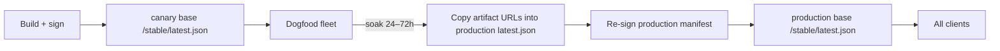

# How to Operate a Release Channel

Shipping a `soli build --standalone` or `soli desktop build` artifact used to mean
freezing a binary in amber. Users downloaded it once, and every fix after that
was a support email: "please re-download." Auto-update closes that loop — the
artifact checks a channel you control, verifies a signed manifest, and replaces
itself.

The hard part is not the code. The hard part is **operating the channel**: keys,
versioning, canaries, rollbacks, and the day someone loses the private key. This
post is that runbook. For the feature surface itself, see the
[auto-update docs](/docs/development-tools/auto-update).

<figure style="margin:1.5rem auto;max-width:1024px;">
  
  <figcaption style="text-align:center;color:#8b949e;font-size:0.875rem;margin-top:0.5rem;">Publish → canary → promote. The signature is the trust root; the CDN is just a delivery pipe.</figcaption>
</figure>

## What a channel actually is

An updatable artifact embeds an **update descriptor** at build time:

| Field | Role |
|-------|------|
| `app_version` | From `soli.toml` `[package] version` — what the updater compares against |
| `update_url` | Base URL you own |
| `channel` | Path segment under the base (defaults to `stable`) |
| `pubkey` | Base64 P-256 public key for manifest verification |

At runtime the app fetches:

```
{update_url}/{channel}/latest.json
```

verifies the signature against the embedded public key, picks the artifact for
its own platform (`linux-amd64`, `darwin-arm64`, …), checks the sha256, stages
the download, and only then atomically renames it over the installed binary.

So a **channel** is not a marketing name. It is a directory on your HTTPS host
whose `latest.json` is the single source of truth for every binary that was
built pointing at that base URL.

## Step 0 — Treat the private key like production root

An auto-updater is a remote-code-execution channel with a nicer UI. Whoever holds
the signing private key can push any binary to every installed client. Treat it
accordingly.

```bash
# Once, on an offline or hardened machine
soli update-keygen
```

You get a PEM private key and a base64 public key. Then:

1. **Store the private key** in a secrets manager (Vault, AWS KMS, 1Password
   vault with break-glass, HSM if you have one). Not the git repo. Not a Slack
   DM. Not the laptop of the person who "always does releases."
2. **Embed only the public key** in every production build via `--update-key`.
3. **Restrict who can run `soli sign-update`.** Ideally one CI job with the
   secret injected, never a shared shell history.
4. **Log every signature.** Who signed what version, when, from which commit
   SHA. When something goes wrong, you will want that trail.

Unsigned manifests are accepted **only** when no key was embedded at build time,
and then only with a loud warning. That path is for local testing. Shipping an
unsigned production channel is volunteering for supply-chain compromise.

## Layout on the CDN

Pick a base URL you control and keep it boring:

```
https://updates.example.com/my_app/
├── stable/
│   ├── latest.json
│   ├── myapp-1.2.0-linux-amd64
│   ├── myapp-1.2.0-darwin-arm64
│   └── myapp-1.2.0-windows-amd64
└── canary/                    # optional second base path / cohort
    ├── latest.json
    └── …
```

Builds currently embed `channel: "stable"` by default, so production clients
resolve `{base}/stable/latest.json`. A second cohort (internal dogfood, beta
testers) is easiest today as a **second base URL**:

```bash
# Production fleet
--update-url https://updates.example.com/my_app

# Dogfood fleet (same channel name, different base → different latest.json)
--update-url https://updates.example.com/my_app-canary
```

Both resolve `…/stable/latest.json` under their own base. Same signing key,
different manifests, independent promotion. When you want to promote canary to
production, you re-point the stable manifest at the same (already-signed)
artifact URLs, or re-sign an identical payload under the production path.

Keep artifacts **immutable**: once `myapp-1.2.0-linux-amd64` is uploaded, never
overwrite it. New content always gets a new version number. Overwriting a URL
breaks the sha256 contract and makes incident forensics impossible.

## The release checklist

This is the whole job, every time:

### 1. Bump the version first

```toml
# soli.toml
[package]
version = "1.2.0"
```

The updater refuses anything that is not **strictly greater** than the running
version. Forgetting the bump means every client reports "already up to date"
while you stare at a freshly uploaded binary.

### 2. Build every platform you ship

```bash
PUBKEY=$(cat update-pubkey.b64)
BASE=https://updates.example.com/my_app

for target in linux-amd64 linux-arm64 darwin-arm64 windows-amd64; do
  soli build ./my_app --standalone \
    --target "$target" \
    --output "dist/myapp-${target}" \
    --update-url "$BASE" \
    --update-key "$PUBKEY"
done
```

Each build drops a `*.update.json` stub next to the artifact — version, sha256,
size, and a guessed URL. Those stubs are the raw material for the manifest.

### 3. Assemble `latest.json`

```json
{
  "version": "1.2.0",
  "notes": "Faster startup. Fix double-submit on checkout.",
  "artifacts": {
    "darwin-arm64": {
      "url": "https://updates.example.com/my_app/stable/myapp-1.2.0-darwin-arm64",
      "sha256": "…",
      "size": 60123904
    },
    "linux-amd64": {
      "url": "https://updates.example.com/my_app/stable/myapp-1.2.0-linux-amd64",
      "sha256": "…",
      "size": 57656963
    }
  }
}
```

Edit the stub URLs to match where you will actually host the files. Clients
download exactly the URL you put here — no rewriting on their side.

Write release notes for humans. They surface in `--check-update` and in
`Updater.check()["notes"]`, so "misc fixes" is a missed opportunity.

### 4. Sign, then upload

```bash
soli sign-update latest.json --key /secrets/update-private.pem
# uploads: latest.json + every artifact to the URLs in the manifest
```

Order matters operationally even though the client verifies before applying:

1. Upload the **binaries first** (clients may race the promote).
2. Upload **`latest.json` last** — that is the atomic flip for the channel.

HTTPS is required in production. The client also floors TLS at 1.2.

### 5. Smoke the channel before you walk away

```bash
# On a machine that already runs 1.1.0
./myapp --check-update
# → Update available: 1.1.0 → 1.2.0

./myapp --update
# → updated to v1.2.0

./myapp --check-update
# → already on latest
```

Also verify a **negative** path once per key ceremony: flip one byte of a
downloaded binary and confirm the sha256 check refuses it; strip the signature
and confirm the client refuses the manifest. Trust is only real if failure is
loud.

## Canary before stable

Do not point the entire fleet at a release the same minute CI finishes. A
minimal canary pipeline:



Practically:

1. Build once. Artifacts are content-addressed by sha256; reusing them is fine.
2. Publish that version under the **canary base** first.
3. Ship dogfood installs with `--update-url` pointing at the canary base
   (internal team, 5% of devices, a single office, …).
4. Watch error rates, crash reports, and support tickets for a soak window.
5. Promote by publishing the **same version and same artifact URLs** under the
   production base (re-sign the production `latest.json`). Clients already on
   canary see "already up to date"; production clients climb the version ladder.

If canary is bad, **do not promote**. Fix forward on canary with `1.2.1`.
Production never saw `1.2.0`.

## Rollback is a forward release

This is the rule people fight until it bites them:

> The updater **never installs a version older than or equal to** the running
> one. Downgrades are refused on purpose.

You cannot "roll back" by republishing `1.1.0` after `1.2.0` has gone out.
Clients on `1.2.0` will ignore it forever.

The correct rollback is:

```
1.2.0  →  bad release (out in the wild)
1.2.1  →  1.1.0 code + a version bump  (or a proper fix)
```

Bump the version, rebuild (or re-tag the known-good tree), sign a new manifest,
publish. The bad binary stays on the CDN as historical truth; it simply stops
being what `latest.json` points at.

If you need an emergency stop and cannot ship a fix yet: leave `latest.json` on
`1.2.0` and stop building new installs from that tag. Existing clients stay on
the bad version until you ship `1.2.1` — which is why canaries exist.

## Key rotation

Rotating the signing key is a **fleet rebuild**, not a CDN edit. The public key
is baked into every already-shipped artifact. A new private key can sign forever;
old clients will reject those signatures because they still hold the old public
key.

Playbook:

1. Generate a new keypair (`soli update-keygen`).
2. From this commit onward, build with the **new** `--update-key`.
3. Sign new manifests with the **new** private key.
4. Old clients keep updating only if you **also** keep signing with the old key
   for as long as old clients matter — or you force a one-time manual reinstall
   that carries the new pubkey.

There is no dual-signature field today. Practical options:

- **Scheduled rotation with a forced reinstall window** (enterprise desktop:
  push a new package via MDM that embeds the new key, then retire the old
  channel).
- **Never rotate unless compromised.** Protect the key so hard that rotation is
  a crisis procedure, not a quarterly chore.
- **Compromise response:** revoke CDN access for the old host if needed, stand
  up a new base URL + new key, and require reinstall. Document that path *before*
  you need it.

If the private key leaks, assume every client will eventually run attacker code.
Rotate, reinstall, and treat it like a production breach.

## In-app updates vs CLI

Two consumption paths share the same channel:

```bash
./myapp --check-update   # report only
./myapp --update         # download + verify + swap
```

```soli
# Controllers / views inside the shipped app
info = Updater.check()
# { "configured": true, "available": true,
#   "current": "1.1.0", "latest": "1.2.0", "notes": "…" }

result = Updater.apply()
# { "status": "updated", "restart_required": true, "message": "updated to v1.2.0" }
```

Outside a built artifact (`soli serve` in development), `Updater` degrades to
`configured: false` — so the same controller can render an "update available"
banner in production and stay quiet in dev.

v1 does **not** silent-auto-apply. That is intentional: unattended binary
replacement is how auto-updaters become malware. Require an explicit
`--update` or a user click that calls `Updater.apply()`. After apply, restart
the process so the new binary is the one listening.

## What to monitor

A channel is healthy when these stay boring:

| Signal | Why |
|--------|-----|
| HTTP 200 rate on `latest.json` | CDN or DNS death looks like "no updates" |
| Signature verification failures in support | Wrong key, truncated upload, or active tampering |
| sha256 mismatches | Corrupted upload or partial object on the CDN |
| Version distribution across fleets | Stuck cohorts, canary not soaking, someone still on 1.0.0 |
| Time from tag → first successful `--update` | Your real release latency |

Log `Updater.check()` results server-side if the app phones home (version,
`available`, errors). You cannot improve what you cannot see.

## Minimal CI sketch

```bash
# .github/workflows/release-channel.yml (sketch)
# triggers on tag v*
set -euo pipefail
VERSION=${GITHUB_REF_NAME#v}
# 1. assert soli.toml version == $VERSION
# 2. build matrix of targets with --update-url / --update-key
# 3. merge stubs → latest.json, set notes from CHANGELOG
# 4. soli sign-update latest.json --key "$UPDATE_PRIVATE_KEY"
# 5. aws s3 cp artifacts…  (binaries first)
# 6. aws s3 cp latest.json s3://…/stable/latest.json
# 7. smoke: download latest.json, verify signature offline, curl each artifact URL
```

The signing step is the only place the private key should appear. Prefer OIDC →
cloud KMS over a long-lived PEM in CI secrets if your threat model warrants it;
the PEM path is what `soli sign-update` speaks today.

## Anti-patterns

- **Overwriting artifact URLs** when a build is "almost the same." New sha256,
  new version, new object key.
- **Shipping without `--update-key`.** Unsigned is for laptops, not customers.
- **Using the same base URL for canary and prod** and flipping one `latest.json`
  for both. You lose the ability to soak.
- **Trying to roll back by republishing an older version.** Bump and fix
  forward.
- **Storing the private key in the app repo "just for convenience."** Convenience
  is how private keys end up on GitHub.
- **Silent background `Updater.apply()` on a timer.** Explicit user or operator
  consent is the product contract in v1.

## The short version

1. Generate a keypair once; lock the private half away.
2. Every release: bump version → multi-platform build with `--update-url` and
   `--update-key` → assemble `latest.json` → sign → upload binaries → upload
   manifest last.
3. Canary on a separate base URL; promote by re-signing the same payload under
   production.
4. Rollback = ship a higher version that undoes the damage.
5. Key rotation = rebuild the fleet; plan it before you need it.

Operate the channel like a production database, not like a file drop. The
clients will trust whatever you sign — that is the feature, and the entire
responsibility.
