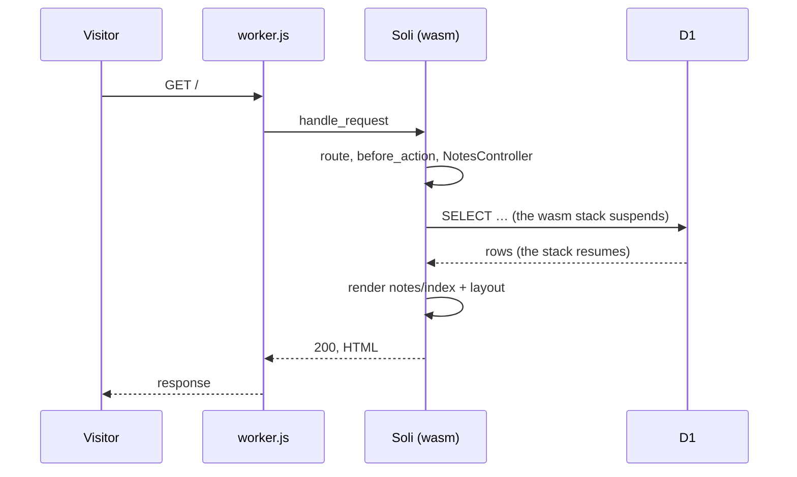

# Soli on Cloudflare Workers, with D1

A Soli app now runs inside a Cloudflare Worker. Not a port of it, not a subset
with its own API: the routes, middleware, controllers, views and models that
`soli serve` runs, answered in the datacenter nearest the visitor, with no server
to keep up. And its models can keep their data in D1, Cloudflare's SQLite, so an
app needs no database server either.

<https://cf.solisoft.net> is one. Ask it who answered:

```bash
$ curl https://cf.solisoft.net/api/info
{"runtime":"cloudflare-workers","version":"2.19.0","colo":"MRS","country":"FR", …}
```

`MRS` is Marseille: that request never left the south of France. This post covers
how to ship an app this way, a small app on D1 you can copy, how a synchronous
interpreter waits on an asynchronous database, and what stays with `soli serve`.

<figure style="margin:1.5rem auto;max-width:1024px;">
  
  <figcaption style="text-align:center;color:#8b949e;font-size:0.875rem;margin-top:0.5rem;">The Soli interpreter, compiled to WebAssembly, runs your app inside the Worker; a query suspends it until D1 or SoliDB answers.</figcaption>
</figure>

## Four commands

```bash
./scripts/build-edge.sh                      # once per Soli version → target/edge
soli edge build . --runtime target/edge      # your app → dist/edge
cd dist/edge && npx wrangler dev             # on workerd, locally
npx wrangler deploy                          # on Cloudflare
```

`build-edge.sh` compiles the Soli library to WebAssembly, once per Soli version.
`soli edge build` turns an app into a plain Wrangler project: the runtime, a
small JavaScript host, the app's source as `src/app.json`, and `public/` as the
Worker's static assets. From there it is an ordinary Worker: `wrangler dev` runs
it on workerd, `wrangler deploy` ships it, and a custom domain is one line of
`wrangler.toml`.

## A notes app on D1

Here is a whole app: a page that lists notes and a form that adds one, each note
stamped with the datacenter it was written from. Nothing in it knows it runs on
the edge.

```soli
# config/routes.sl
get("/", "notes#index")
post("/notes", "notes#create")
```

```soli
# app/models/note.sl
class Note < Model
  validates("body", {"presence": true, "max_length": 280})
end
```

```soli
# app/controllers/notes_controller.sl
class NotesController < Controller
  # GET / — the latest notes, and the datacenter that rendered the page
  def index(req)
    @notes = Note.order("posted_at", "desc").limit(20).all
    @colo = req["headers"]["cf-colo"] ?? "local"
  end

  # POST /notes
  def create(req)
    Note.create({
      "body": params["body"].to_s.trim,
      "colo": req["headers"]["cf-colo"] ?? "local",
      "posted_at": DateTime.utc.to_iso
    })
    redirect("/")
  end
end
```

```erb
<!-- app/views/notes/index.html.slv -->
<h1>Notes from the edge</h1>
<p>Rendered in <%= @colo %>.</p>

<form method="post" action="/notes">
  <%- csrf_field() %>
  <input name="body" placeholder="Say hello" maxlength="280">
  <button>Post</button>
</form>

<% for note in @notes %>
  <article>
    <p><%= note.body %></p>
    <small>from <%= note.colo %>, <%= note.posted_at %></small>
  </article>
<% end %>
```

The only edge-specific part is configuration. Create the database, then bind it
in the `wrangler.toml` that `soli edge build` wrote:

```bash
npx wrangler d1 create notes-db        # prints the database_id
```

```toml
[[d1_databases]]
binding = "DB"
database_name = "notes-db"
database_id = "…"

[vars]
SOLI_DB_ADAPTER = "d1"
```

`SOLI_DB_ADAPTER = "d1"` puts the models on D1, through the binding named `DB`.
There is no migration to write: the `notes` table is created on the first write.

We ran this exact app on workerd with a local D1 (`wrangler dev`): the blank note
is refused by the validation, the other two land in the `notes` table, and the
page lists them newest first. A page, query and render included, took 16 ms on
the first request of the isolate and about 7.5 ms after that. Under `wrangler
dev` the database lives in `.wrangler/state`, and you can look inside:

```bash
npx wrangler d1 execute notes-db --local --command "SELECT count(*) FROM notes"
```

The same code runs under `soli serve` with `SOLI_DB_ADAPTER=sqlite`: D1 is SQLite,
and the D1 adapter is the SQLite adapter's document model with its SQL sent to
the binding. Develop on a laptop, ship to the edge.

## How it works

The edge runtime is the Soli library built for `wasm32-unknown-unknown`, without
its HTTP server, its CLI and the builtins that need a socket, a thread or a disk:
about 9 MB of WebAssembly, 3 MB compressed.

At the first request, an isolate instantiates it, mounts the app's files in
memory (a Worker has no filesystem), and boots the app the way a `soli serve`
worker does: models, controllers, helpers, routes, locales. That happens once per
isolate and takes a few tens of milliseconds. Every request after that goes
through `handle_request`, the same function `soli serve`'s workers call:
middleware, CSRF, routing, the action on the bytecode VM, the view and its
layout. Same code path, so the same behavior.

## A synchronous interpreter on an asynchronous database

There is one real difficulty. The interpreter is synchronous: when your action
calls `Note.where(…).all`, it expects the rows back before the next line runs.
But inside a Worker, every way to reach data is asynchronous: D1's
`prepare(…).bind(…).all()` returns a Promise, and so does `fetch`.

Rewriting the interpreter around `async` would have meant two interpreters.
Instead, the runtime uses [JavaScript Promise Integration](https://v8.dev/blog/jspi)
(`WebAssembly.Suspending` and `WebAssembly.promising`), which Cloudflare's V8
supports: when a model query needs D1, the WebAssembly stack is *suspended* at
that call, the Promise runs, and the stack resumes with the rows, exactly where
it stopped.



Your code does not change, and it does not know: `Note.where(…).all` reads the
same in a Worker as on a server.

## D1 underneath

The D1 adapter stores each model the way the SQLite adapter does: a table per
model with a `_key` column and a JSON `doc` column. Queries are SQLite's SQL,
sent with `prepare(…).bind(…).all()`. Each statement is a round trip to D1, so
the adapter avoids the extra ones: a write returns the stored row with
`RETURNING doc` instead of reading it back, `create_many` sends its rows in
chunks under D1's limit of 100 bound parameters, and `grouped(fn() { … })`
batches reads as it does elsewhere.

Models work as they do under `soli serve`: `find` (a miss is a 404), `where`,
`order`, `count`, aggregates, `create`, `update`, `delete`, `update_all`,
`delete_all`, validations and callbacks. Three things raise instead, with a
message that says why:

- **Transactions.** D1 runs batches, not interactive transactions, so
  `Model.transaction` raises rather than pretending.
- **Column-aware models**, which declare their columns: store them as documents.
- **Jobs and cron**, which have no worker on the edge anyway.

If D1 is not the right home for the data, the same app can use SoliDB instead,
over HTTPS with `fetch`, configured with `SOLIDB_HOST` and the usual credentials
(the password as a Wrangler secret).

## What stays with soli serve

| Runs on the edge | Stays with `soli serve` |
|------------------|-------------------------|
| routes, controllers, `before_action`, middleware | WebSockets, LiveView |
| views, layouts, partials, components, helpers | server-sent events, `stream` (answered `501`) |
| query strings, URL-encoded forms, JSON | multipart uploads, file writes |
| i18n from `config/locales` | background jobs, cron, sending mail |
| models on D1, or on SoliDB over HTTPS | PostgreSQL, MySQL, SQLite, the native SoliDB driver |
| the `HTTP` class, over `fetch` | `--dev`: hot reload, dev bar, REPL |

A builtin that needs what a Worker lacks fails with a message naming the edge
build, rather than misbehaving.

Three limits are worth knowing before you ship:

- **One request at a time per isolate.** A request waiting on D1 keeps its
  isolate's wasm stack, and the next request in that isolate queues behind it.
  Cloudflare spreads load across isolates, but a slow query delays its
  neighbours.
- **Sessions:** the in-memory store lives only as long as an isolate. Use the
  `cookie` driver (`SOLI_SESSION_DRIVER=cookie` and a `SOLI_SESSION_SECRET`
  secret of 32 characters or more).
- **Size:** 3 MB compressed fits the paid plan, and sits at the edge of the free
  plan's limit.

## Try it

<https://cf.solisoft.net> is `examples/cloudflare-worker` in the Soli
repository, and it walks through all of this in pages of its own. Its
[D1 page](https://cf.solisoft.net/d1) is a model on D1 you can press: each
check-in is written by the Worker that answers you, and the page shows how long
its queries spent in D1. Both the
Workers build and D1 ship in Soli 2.21. The reference is the
[edge guide](/docs/development-tools/edge), with every option of
`soli edge build`, the configuration and the troubleshooting table.
