# The 4,329-Line Function, and the Request Path That Came After It

`REVIEW.md`, the repository's own audit, has a table headed **God functions**. It
listed five: `register_model_class` at 3,904 lines, `handle_hyper_request` at 1,122,
`run_hyper_server_worker_pool` at 993, `handle_request` at 922 and `worker_loop` at 632.
By the time anyone went to fix them, the first had grown to **4,329** and
`handle_hyper_request` to 1,457. Long functions do not stay the same length: they are
where the next change lands, because that is where the last one did.

The 4,329-line function was not on the request path — it registered the whole ORM
surface. It went first because it was the largest, and because it was the easy one: a
pure move that set the method for the four that followed. Those four are the HTTP
server — boot, socket, worker loop, request. Over two days in September they became
short functions in modules whose names say what they hold, and no Soli program can tell
the difference. Along the way the split turned up one bug a user could
see, and several places where two copies of the same code had stopped agreeing.

<figure style="margin:1.5rem auto;max-width:1024px;">
  
  <figcaption style="text-align:center;color:#8b949e;font-size:0.875rem;margin-top:0.5rem;">Four god functions before and after, and the modules the server code moved into. Line counts are the ones recorded in each commit.</figcaption>
</figure>

## Why a long function costs more than its length

The cost of `register_model_class` was not that it was hard to read. It was that
**every ORM change touched it**, so two unrelated changes collided in one place, and
finding a method meant scrolling past all the others. `core.rs` ran to 7,293 lines
because of it.

The request path had the same problem plus a worse one. `handle_hyper_request` was a
cascade of early returns, and the order of those returns is a security decision: one
endpoint is served before the same-origin gate, eight after it, and WebSocket upgrades
skip it on purpose. When all of that sits in one 1,457-line function, the order is
recorded only in comments spread across it, and the next "tidy-up" can undo it without
noticing.

The real case for splitting, though, came from what the splits found: **every
duplicate that came apart had already drifted.** More on that below.

## The first cut: a move, not a rewrite

`register_model_class` registered each ORM method as an inline closure into a map. The
split left it twenty-two lines that point at eight sibling files — `register_dsl`,
`register_chain`, `register_crud`, `register_mutate`, `register_finders`,
`register_aggregate`, `register_search` and `register_instance` (973 lines, the methods
called on a record). `core.rs` went from 7,293 to 3,004.

Three details made it a move rather than a rewrite, and they apply to any Rust split of
this kind:

- **Siblings, not a subdirectory.** The first attempt put them in `register/`, and it
  was wrong. The moved code carried 224 `super::` paths into sixteen sibling modules,
  and a directory changes what every one of them means. As flat files the move is
  exact: no path rewritten, no line of a closure touched.
- **Check what the code reaches before you cut it.** Each section referenced nothing
  outside itself — no `env`, and no use of either map other than `insert`. The diff was
  checked for that before anything moved.
- **Know whether order matters, and keep it anyway.** The maps are `HashMap`s keyed by
  method name, so insertion order is irrelevant. It was kept regardless, so the diff
  reads as a move.

Fifteen helpers in `core.rs` went from private to `pub(super)`. The commit calls that
"the honest visibility": other code in the module had always used them, and the one big
function was all that hid it. 3,582 Rust tests and 3,178 specs passed, unchanged.

## Setup first, requests second

On the server side, the first thing out was the dev file watcher. It left
`run_hyper_server_worker_pool` (1,173 lines → 806) for `serve/file_watcher.rs`. It
went first on purpose: it is setup, not request handling, **so a mistake shows up at
boot rather than on one request in a thousand.**

Every value the watcher captured had already been cloned into a named local just
above the `thread::spawn`, so the extraction was mostly a signature; thirteen `watch_*`
paths became a `WatchPaths` struct. Two captures were not among those locals and only
the compiler knew about them — the shared `HotReloadVersions` and a code-graph reindex
sender. Both are parameters now: inputs visible instead of ambient.

## Early returns that were functions, not stages

The key distinction in the series is between **a function and a stage**. A stage
takes state from the one before it and hands state on. A function takes a path, some
headers and a peer address, and answers or passes. Most of `handle_hyper_request` was
functions dressed up as stages:

- **Nine things the binary serves from itself** — the nav and prefetch scripts, the
  native-bridge shim and helpers, the LiveView client and others — became
  `serve/framework_assets.rs`. There are **two entry points, not one**: the LiveView
  client is served *before* the same-origin gate and the other eight *after* it.
  Merging them would have moved eight endpoints to the wrong side of a check.
- **`/_health`, `/_ready`, `/_metrics`** became `serve/probes.rs`. The reasoning
  moved with the code: liveness stays 200 through a drain so an orchestrator does not
  restart a container that is shutting down normally; readiness is 503 while booting and
  for the whole drain; and a refused `/_metrics` returns **404 rather than 403**, so the
  endpoint does not reveal that it exists.
- **The four sockets** — live reload, an EUI session, LiveView and the app's own
  `websocket_routes` — were 376 lines, including a 200-line LiveView connection loop inside an
  HTTP handler. They are `serve/upgrade.rs` now. This was **a move, not a merge**, because the same-origin gate tests
  `!is_upgrade_request(&req)` precisely so upgrades run ungated. Each of the four branches
  makes up for that with its own `websocket_origin_allowed`, and those checks travelled
  inside their branches in the order they stood.
- **Eleven `--dev` routes** became one `match` in `serve/dev_routes.rs` behind one
  trusted-peer gate. Two arms consume the request, so `dispatch` returns
  `Result<Response, Request>` and **hands the request back on a miss** — splitting it in
  two would have put those arms in front of the gate.

The **public directory** was the one that had drifted. `handle_hyper_request` served a
file from `public/` three ways: from the production asset cache, from a production disk
read with an mtime ETag, and from a dev-mode read. Each had its own conditional-GET arm,
its own `Range` arm and its own full-body arm — nine arms for one behaviour with three
sources. Only the dev arm had the defensive slice bound. `serve/static_files.rs` is now
one responder that takes bytes-or-file, a content type and an optional ETag. The
responder had never had a unit test and now has nine.

## Stages that hand each other locals

The rest of `handle_hyper_request` was a real pipeline, which is why it came out last.
Its four stages do not return early; they pass **nine live locals** from one to the
next, so nothing could be lifted out until those locals had a name. `serve/pipeline.rs`
names them `Intake`, and after that the stages are ordinary functions: `intake` reads
the body, `enqueue` hands the work to a worker, `await_worker` waits, `assemble` builds
the reply.

Two of `Intake`'s fields exist only because of an ordering that was invisible while this
was one function. `if_none_match` and `is_prefetch` are read *before* the headers are
moved into the `RequestData`, because the reply built two hundred lines later still
needs them. As struct fields with a doc comment, that ordering is a stated constraint
rather than a line someone could helpfully move.

The listener underneath had the same shape. `run_hyper_server_worker_pool` ended with
261 lines of nesting: an OS thread, a tokio runtime, an accept loop, a connection task,
and the closure that answers one request. Everything the innermost layer needed had been cloned into a `*_for_tokio` local
twenty lines above — **the sign that it wanted to be a function and was a closure only
because nothing had named the boundary.** `serve/accept.rs` names it five times: `spawn`,
`bind`, `accept_loop`, `serve_connection` and `dispatch`. The clones became fields of a
`Server` struct. One of them, `let _ws_registry = ws_registry_for_tokio.clone()`, turned out
to be an `Arc` cloned and dropped **on every connection** for nothing.

## The worker side

`handle_request` runs on the worker thread, inside the interpreter. It was 1,108 lines
when the series started. Seven modules came out of it. Six are below; the seventh
follows:

- `builtin_endpoints` — `/up` and `/openapi`, answered before any session exists, so
  a readiness probe never creates one.
- `request_scope` — worker threads are pooled, so this is the module about **not
  inheriting the previous visitor**: eight log buffers, the test runner's captured
  render, taint marks, cookie-driver state, response cookies and the response cache.
- `route_match` — the lookup, and the 404 it returns when nothing matches.
- `request_input` — the one place hyper's request becomes the hash a controller reads.
- `middleware` — scoped and global middleware had been the same hundred lines written
  twice. They differed in three tokens and in one four-line comment the global copy had
  lost. `middleware::run` returns `Step::Continue(request)` or `Step::Halt(response)`,
  and each loop is now four lines.
- `error_response` — "mint a request id, render the production error page, wrap it in
  an HTML response" had been written out **nine times**. The helper that did it already
  existed twice, 600 lines above three of the hand-written copies.

The last one was the best example of the series. The tail of every request was a
**276-line closure** that read fourteen locals defined up to 550 lines above it, called
from three `return` statements. A closure shared by three returns is a function whose
arguments were never written down. `finalize.rs` writes them down as a `Finalizer`
struct, one doc comment per field, and splits the body along the comment blocks that were
already there:

```rust
pub(super) fn finish(
    f: &Finalizer,
    method: &str,
    path: &str,
    mut resp: ResponseData,
) -> ResponseData {
    cookies(f, &mut resp);
    security_headers(&mut resp);
    trace_headers(f, &mut resp);
    test_runner_headers(&mut resp);
    dev_snapshot(f, method, path, &mut resp);
    export_traces(f, &resp);
    access_log(f, method, path, &resp);
    // ...
    resp
}
```

The order is load-bearing — each step reads what the one before it wrote — and the
function says so. `method` and `path` stay parameters rather than fields: they borrow
from a `RequestData` whose `headers` have already been taken, so as fields they would
need a lifetime, and as parameters they need nothing. `handle_request` went from 900
lines to 258.

One thing was deliberately *not* moved. `request_scope::install` sets the request's
locale, but the `LocaleGuard` that restores the default is still bound in
`handle_request`. A guard created and dropped inside `install` would restore the
default locale before the handler ran. The module header says so, next to the code most
likely to tempt someone into moving it.

## The pipeline now

This is the path a request takes through the current code, from the listening thread to
the worker and back. Every box is a function you can open.

```mermaid
flowchart TD
  subgraph L["accept.rs — the listener"]
    A1["spawn: OS thread + tokio runtime"] --> A2["bind: find a port"]
    A2 --> A3["accept_loop: take sockets"]
    A3 --> A4["serve_connection: one per socket"]
    A4 --> A5["dispatch: drain check, Host to app (421 on miss), tenant scope, CORS preflight"]
  end
  subgraph H["handle_hyper_request — the cascade, in order"]
    B1["desktop::token::gate_request"] --> B2["probes: /_health /_ready /_metrics"]
    B2 --> B3["framework_assets::live_client"]
    B3 --> B4{"same-origin gate, skipped for upgrades"}
    B4 --> B5["eui::http_get"]
    B5 --> B6["upgrade::handle: 4 sockets, each origin-checked"]
    B6 --> B7["static_files::handle: public/"]
    B7 --> B8["framework_assets::bundled"]
    B8 --> B9["live_reload, dev_jobs, dev_errors"]
    B9 --> B10["dev_routes: trusted-peer gate"]
    B10 --> B11["coverage, reserved /__ paths 404"]
    B11 --> B12["files::handle: file mode"]
    B12 --> P1["pipeline::intake: body, multipart"]
    P1 --> P2["pipeline::enqueue"]
  end
  subgraph W["handle_request — on a worker"]
    W1["request_scope::reset_worker_thread_locals"] --> W2["builtin_endpoints: /up /openapi"]
    W2 --> W3["request_scope::install + LocaleGuard"]
    W3 --> W4["CSRF token check"]
    W4 --> W5["route_match::resolve: 404 + session cookie"]
    W5 --> W6["request_input::build"]
    W6 --> W7["middleware::run: scoped, then global"]
    W7 --> W8["call_handler"]
    W8 --> W9["finalize::finish"]
  end
  A5 --> B1
  P2 --> W1
  W9 --> P3["pipeline::await_worker"]
  P3 --> P4["pipeline::assemble: 304, prefetch, dev bar"]
```



What remains of `handle_hyper_request` is the dispatch cascade and the handoff, **with
no stage of the pipeline left inside it**; its length is the order of the early returns
and the comments explaining it.

## The bug the refactor surfaced

`route_match` is where the split found something a user could see (commit `8223f821`).

A route lookup can miss in two ways. Either nothing matches the path, or a wildcard
route like `get("/wildcard/*", "wildcard#*")` matches but the action can't be expanded
from the path. Both are 404s, one lookup apart, and the two copies had drifted. The
route miss wrote an access-log line and called `finalize_session_cookie`. The wildcard
miss did neither:

```rust
// before: the wildcard miss
} else {
    // Clear session context before returning 404
    set_current_session_id(None);
    return error_response::production(
        404, method, path, "Action not found for this route.", None,
    );
}
```

With the ID session drivers you can't see it: `finalize_session_cookie` returns `None`
when the id hasn't changed. With `SOLI_SESSION_DRIVER=cookie` you can. The cookie
driver re-emits whenever the incoming blob was invalid or expired and got replaced, so
a 404 from a failed wildcard expansion dropped the replacement cookie that a route-miss
404 kept. The browser went on sending the dead blob.

Now both paths call one `route_match::not_found`, which writes the access line and
emits the cookie. Its `Secure` flag is computed once by the caller and passed in, which
also deleted the second copy of the `X-Forwarded-Proto` block the 404 path had carried.

It was not the only drift. The directories a worker loads beside its models were
listed twice — first load and hot reload — and the second list was a directory short:
editing a mailer in `--dev` reloaded everything except the mailer (`906a3159`). Now
there is one list, `app_loader::load_models_and_siblings`.

## How it stayed safe

Almost every commit in the series ends with the same kind of paragraph, and it is the
part worth copying: each change was **verified against a running server, old binary
against new**, with the transcripts compared. For static files, sixteen probes in
production and `--dev` — weak and stale `If-None-Match`, four `Range` forms, traversal —
comparing status, headers and a hash of the body. For upgrades, same-origin,
cross-origin and Origin-less handshakes against all four socket paths. For the
listener, HTTP/1.1, h2c, keep-alive, CORS preflights, `--strict-port` and SIGTERM. For
middleware, an app built to deny, return garbage and raise.

The only differences allowed were ones **the baseline binary also shows between two of
its own runs** — request ids, dev-bar timings, a `Date` header. If the old binary
disagrees with itself on a line, that line cannot count as a regression.

Tests went where there had been none. `pipeline::assemble` got eight, "eight more
than this code has ever had" — its 304 short-circuit was exercised only by an
end-to-end suite wired to no CI job. The middleware runner got four and the static-file
responder nine. That unwired suite also failed two tests on the pre-change binary, which
the commit records as "rot in a suite nothing runs, not a regression here".

Comments were treated as code. Reasoning comments moved verbatim; a doc comment on
why the dev REPL trusts only loopback (SEC-051), which had drifted onto
`metrics_request_allowed`, went back to `is_trusted_dev_peer`; six comments still naming
the old closure were fixed in their own commit. And `www/docs/internals/serve.md` got a
table with one row per stage.

## What carries over to any Rust server

- **A closure that captures a dozen locals is a function with its arguments left
  implicit.** Clones like `*_for_tokio` made just above a `spawn` are the sign. Put
  them in a struct and give each field a sentence.
- **Tell functions from stages.** A function answers from its inputs and can move
  anywhere. A stage passes state along, and you have to name that state before you can
  lift the stage out.
- **In an HTTP handler, order is a security property.** When two early returns sit on
  opposite sides of a gate, give them two entry points. When a branch is ungated on
  purpose, move its checks with it. Don't merge.
- **A duplicate loses its reasons before it loses its behaviour.** The two middleware
  loops still behaved the same; one had just lost the comment explaining why. Every
  duplicate this series took apart had drifted in some way.
- **Some things stay in the caller.** An RAII guard has to be bound where the scope it
  protects lives. Borrows that would need a lifetime as fields often need nothing as
  parameters.
- **Leave alone what should stay one piece.** `vm.rs::run_dispatch` is 2,810 lines
  and the audit keeps it: a bytecode dispatch `match` is the right shape for that job.

The audit table now has two columns — the line count when measured and the line count
today — so it still records what was found without claiming it is the current state. As
its own commit put it, a review document whose numbers are wrong is worse than none.
