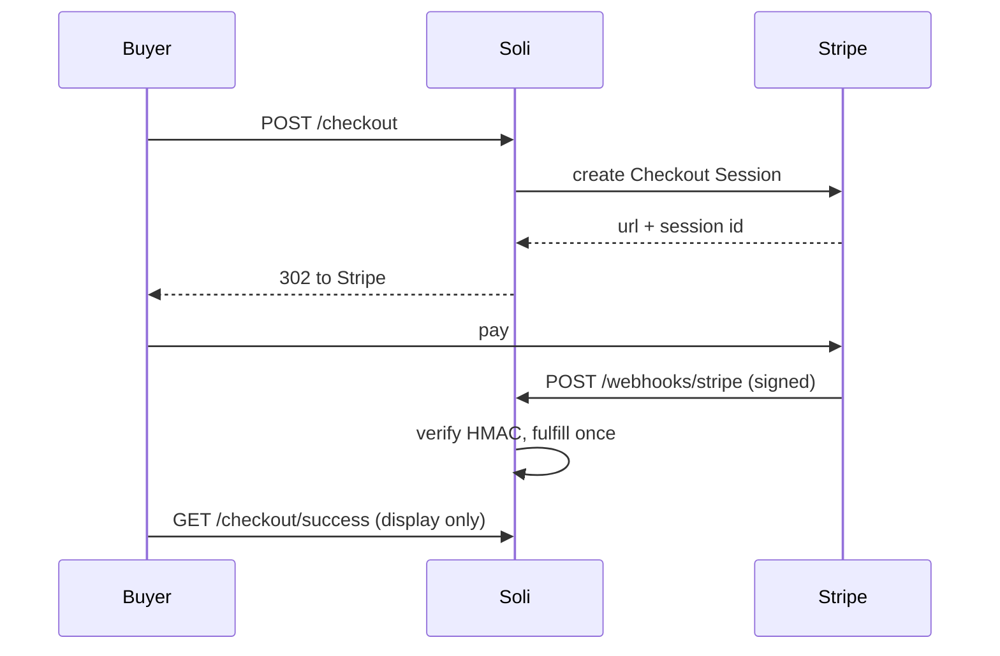

# Taking Payments with Stripe in a Soli App

There is no `soli generate stripe`. Payments are a short, sharp path you should
be able to read end to end: create a Checkout Session, send the buyer to Stripe,
and **mark the order paid only when Stripe POSTs a signed webhook**. The success
URL is a thank-you page, not a source of truth.

This post builds that path with Checkout (hosted payment page), a webhook that
verifies `Stripe-Signature`, and an idempotent fulfill. No Stripe SDK, no extra
process — `HTTP.post`, `Crypto.hmac`, `secure_compare`, and `skip_csrf`.

<figure style="margin:1.5rem auto;max-width:1024px;">
  
  <figcaption style="text-align:center;color:#8b949e;font-size:0.875rem;margin-top:0.5rem;">Trust the webhook. The success URL is for the buyer, not for your ledger.</figcaption>
</figure>

## The Shape

```
app/models/order.sl
app/services/stripe.sl                 # Checkout + signature check
app/controllers/checkouts_controller.sl
app/controllers/webhooks_controller.sl
app/views/checkouts/new.html.slv
app/views/checkouts/success.html.slv
config/routes.sl                       # skip_csrf on the webhook
```

The controller that starts Checkout never decides "this is paid". The webhook
does, after it has verified the signature on the **raw** body.



## Step 1: A Stripe account and two secrets

1. Create a [Stripe](https://dashboard.stripe.com/) account and stay in **test mode**.
2. [Developers → API keys](https://dashboard.stripe.com/test/apikeys): copy the
   **Secret key** (`sk_test_…`).
3. Create a [Product](https://dashboard.stripe.com/test/products) with a Price
   (`price_…`). You can also pass `price_data` inline; a Price id keeps the
   catalogue in the Dashboard.
4. [Developers → Webhooks](https://dashboard.stripe.com/test/webhooks) → **Add
   endpoint**. For local work, skip the Dashboard and use the CLI (step 7).
   Copy the **Signing secret** (`whsec_…`).

```bash
# .env — never commit these
STRIPE_SECRET_KEY=sk_test_...
STRIPE_WEBHOOK_SECRET=whsec_...
STRIPE_PRICE_ID=price_...
APP_BASE_URL=http://localhost:3000
```

`getenv` inside the service, not at file load, so a `.env` edit + `--dev`
reload picks up a new key.

## Step 2: Skip CSRF on the webhook only

Stripe POSTs from their servers with no browser `Origin` and no Soli CSRF
token. The scaffold already comments this case:

```soli
# config/routes.sl
skip_csrf("/webhooks/stripe")

post("/checkout", "checkouts#create")
get("/checkout/success", "checkouts#success")
get("/checkout/cancel", "checkouts#cancel")
post("/webhooks/stripe", "webhooks#stripe")
```

Do **not** `SOLI_DISABLE_CSRF=true` for this. Only this path is a machine
callback; the Checkout start is a browser form and must keep the token
`form_with` already embeds.

## Step 3: Persist an order first

Create the row **before** talking to Stripe, then put its id on the session as
`client_reference_id` / `metadata`. The webhook will look the order up from
that, not from the query string of the success URL.

```soli
# app/models/order.sl
class Order < Model
  validates("email", { "presence": true })
  validates("status", { "presence": true })
end
```

Statuses you actually use: `pending` → `paid` (and later `refunded` if you
handle `charge.refunded`). Do not invent a `paid` row only after Checkout
returns.

## Step 4: A thin Stripe wrapper

Stripe's REST API is form-urlencoded. `HTTP.post` + `url_encode` is enough.

```soli
# app/services/stripe.sl
class Stripe
  CHECKOUT_URL = "https://api.stripe.com/v1/checkout/sessions"
  TOLERANCE_SECS = 300

  static def secret
    key = getenv("STRIPE_SECRET_KEY")
    raise("STRIPE_SECRET_KEY is not set") if key.blank?
    key
  end

  static def webhook_secret
    key = getenv("STRIPE_WEBHOOK_SECRET")
    raise("STRIPE_WEBHOOK_SECRET is not set") if key.blank?
    key
  end

  static def create_checkout_session(order)
    base = getenv("APP_BASE_URL") || "http://localhost:3000"
    price = getenv("STRIPE_PRICE_ID")
    raise("STRIPE_PRICE_ID is not set") if price.blank?

    body = [
      "mode=payment",
      "line_items[0][price]=#{url_encode(price)}",
      "line_items[0][quantity]=1",
      "success_url=#{url_encode(base + "/checkout/success?session_id={CHECKOUT_SESSION_ID}")}",
      "cancel_url=#{url_encode(base + "/checkout/cancel")}",
      "client_reference_id=#{url_encode(str(order.id))}",
      "metadata[order_id]=#{url_encode(str(order.id))}",
      "customer_email=#{url_encode(order.email)}"
    ].join("&")

    HTTP.post(CHECKOUT_URL, body, {
      "headers": {
        "Authorization": "Bearer #{Stripe.secret()}",
        "Content-Type": "application/x-www-form-urlencoded"
      }
    })
  end

  # Stripe-Signature: t=<unix>,v1=<hex>[,v1=…,v0=…]
  # signed payload is "#{t}.#{raw_body}" — must be the bytes Stripe hashed,
  # not a re-serialized JSON object.
  static def verify_signature(raw_body, header)
    return false if raw_body.blank? || header.blank?

    parts = {}
    for piece in header.split(",")
      eq = piece.index_of("=")
      next if eq < 0
      parts[piece.substring(0, eq).trim()] = piece.substring(eq + 1).trim()
    end

    timestamp = parts["t"]
    given = parts["v1"]
    return false if timestamp.blank? || given.blank?

    age = DateTime.utc().to_unix() - timestamp.to_i()
    return false if age.abs() > TOLERANCE_SECS

    expected = Crypto.hmac("#{timestamp}.#{raw_body}", Stripe.webhook_secret())
    secure_compare(expected, given)
  end
end
```

A few details that are easy to get wrong:

- **`{CHECKOUT_SESSION_ID}` is Stripe's placeholder.** They substitute it on
  redirect. Leave the braces in the success URL.
- **`Crypto.hmac` returns lowercase hex**, which matches Stripe's `v1`.
- **`secure_compare`**, never `==`, for the digest.
- **Reject stale `t`.** Five minutes is Stripe's default tolerance. Without it,
  a captured signed body stays valid forever.
- **Several `v1` values can appear** (rolling secrets). The snippet above takes
  the first `v1`. If you rotate secrets, loop every `v1=` and succeed if any
  matches.

Stripe's official libraries also try `v0` (test helper). You can ignore `v0`
in production.

## Step 5: Start Checkout from the app

```soli
# app/controllers/checkouts_controller.sl
class CheckoutsController < Controller
  def new
    render("checkouts/new")
  end

  def create
    email = params["email"].to_s.trim()
    order = Order.create({
      "email": email,
      "status": "pending",
      "amount_cents": 2000
    })
    unless order.valid?
      @order = order
      return render("checkouts/new")
    end

    response = Stripe.create_checkout_session(order)
    payload = json_parse(response["body"]) rescue {}

    if response["status"] != 200 || payload["url"].blank?
      order.update({ "status": "failed", "error": str(payload["error"]) })
      @error = "Could not start checkout"
      @order = order
      return render("checkouts/new")
    end

    order.update({ "stripe_session_id": payload["id"] })
    redirect(payload["url"])
  end

  def success
    # Display only. Payment is confirmed in the webhook.
    @session_id = params["session_id"]
    @order = Order.find_by("stripe_session_id", @session_id) if @session_id.present?
    render("checkouts/success")
  end

  def cancel
    render("checkouts/cancel")
  end
end
```

The new-checkout form is an ordinary `form_with` POST so CSRF applies:

```erb
<%# app/views/checkouts/new.html.slv %>
<h1>Checkout</h1>
<%- form_with({ "url": "/checkout" }) do |f| -%>
  <%- f.email_field("email", {"placeholder": "you@example.com", "required": true}) %>
  <%- f.submit("Pay with Stripe") %>
<%- end -%>
```

If your `form_with` helper needs a record, a hand-written form plus
`csrf_field()` is the same contract:

```erb
<form method="post" action="/checkout">
  <%- csrf_field() %>
  <input type="email" name="email" required>
  <button type="submit">Pay with Stripe</button>
</form>
```

The success page should say **we're confirming your payment**, and show
`paid` only if the order already is. A fast webhook often wins the race; a
slow one must not look like a failed charge.

## Step 6: Fulfill on the webhook — once

```soli
# app/controllers/webhooks_controller.sl
class WebhooksController < Controller
  def stripe
    raw = req["body"].to_s
    header = req["headers"]["stripe-signature"].to_s
    unless Stripe.verify_signature(raw, header)
      return { "status": 400, "body": "invalid signature" }
    end

    event = json_parse(raw) rescue null
    return { "status": 400, "body": "invalid json" } if event.nil?

    type = event["type"].to_s
    data = event["data"]["object"] || {}

    if type == "checkout.session.completed"
      fulfill_checkout(event["id"], data)
    end

    { "status": 200, "body": "ok" }
  end

  def fulfill_checkout(event_id, session)
    order_id = session["client_reference_id"] || (session["metadata"] || {})["order_id"]
    return if order_id.blank?

    order = Order.find(order_id) rescue null
    return if order.nil?

    # Stripe retries webhooks. A second delivery must be a no-op.
    return if order.status == "paid"
    return if order.stripe_event_id == event_id

    unless session["payment_status"] == "paid"
      return
    end

    order.update({
      "status": "paid",
      "stripe_event_id": event_id,
      "stripe_session_id": session["id"],
      "paid_at": DateTime.utc()
    })

    ReceiptJob.perform_later({ "order_id": str(order.id) })
  end
end
```

`Order.find` raises if the id is unknown — rescue and return 200 so Stripe
does not retry a payload you will never apply. Return **400 only** for a bad
signature or unreadable body; a 2xx tells Stripe to stop.

Fulfillment that sends mail or talks to another API belongs in a job
([Jobs](/docs/builtins/jobs)), not in the webhook action. The webhook's job
is: verify, persist, enqueue, 200.

## Step 7: Develop with the Stripe CLI

Dashboard endpoints cannot reach `localhost`. Forward events:

```bash
stripe listen --forward-to localhost:3000/webhooks/stripe
```

The CLI prints a `whsec_…` — put **that** in `STRIPE_WEBHOOK_SECRET` while
listening. Trigger a test payment:

```bash
stripe trigger checkout.session.completed
```

Or click through Checkout with test card `4242 4242 4242 4242`, any future
expiry, any CVC.

## What not to do

- **Do not mark paid on `GET /checkout/success`.** Anyone can open that URL.
- **Do not HMAC `json_stringify(req["json"])`.** Key order and whitespace
  will not match Stripe's bytes. Sign `req["body"]`.
- **Do not skip the timestamp check.**
- **Do not log `sk_` / `whsec_` values.** Log `event["id"]` and `order.id`.
- **Do not generate a Stripe integration.** The surface is small; the
  mistakes (success-URL fulfillment, re-serialized HMAC, missing
  `skip_csrf`) are cheaper to review in your app than to hide behind a
  scaffold you never read.

## Going further

- **Subscriptions:** `mode=subscription` and listen for
  `customer.subscription.updated` / `invoice.paid` the same way.
- **Customer portal:** create a
  [Billing Portal session](https://docs.stripe.com/api/customer_portal/sessions)
  with the same `HTTP.post` form pattern.
- **Idempotency keys** on session create (`Idempotency-Key` header) if a
  double-click on Pay could open two sessions for one order.
- **Connect / multiple prices:** still one webhook; branch on `event["type"]`
  and keep fulfillment idempotent.

The money path should stay boring: one signed POST you can read in a page of
Soli, and a status column you only advance from that POST.
